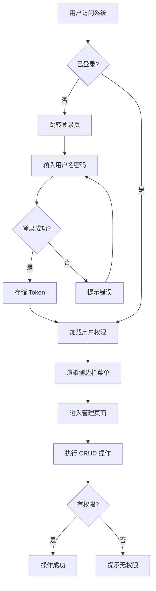

## 1. 产品概述

FastAPI-RBAC 后台管理系统前端，为 RBAC 权限管理系统提供可视化的管理界面。基于 Vue3 + Ant Design Vue 构建，对接 FastAPI 后端 API，实现用户、角色、权限、菜单、部门、日志的完整管理功能。

- 目标用户：系统管理员、运维人员
- 核心价值：提供直观的权限管理操作界面，降低 RBAC 系统的管理复杂度

## 2. 核心功能

### 2.1 用户角色

| 角色 | 注册方式 | 核心权限 |
|------|----------|----------|
| 超级管理员 | 后端初始化 | 全部模块的增删改查 |
| 普通管理员 | 管理员创建 | 根据角色分配的权限 |

### 2.2 功能模块

1. **登录页**: 用户名密码登录、JWT 认证
2. **仪表盘**: 系统概览、统计数据
3. **用户管理**: 用户列表、创建/编辑/删除用户、角色分配
4. **角色管理**: 角色列表、创建/编辑/删除角色、权限与菜单分配
5. **权限管理**: 权限列表、创建/编辑/删除权限
6. **菜单管理**: 菜单树、创建/编辑/删除菜单
7. **部门管理**: 部门树、创建/编辑/删除部门
8. **操作日志**: 日志列表查询、按用户筛选

### 2.3 页面详情

| 页面名称 | 模块名称 | 功能描述 |
|----------|----------|----------|
| 登录页 | 登录表单 | 用户名密码输入、登录验证、Token 存储 |
| 仪表盘 | 统计卡片 | 用户数、角色数、权限数、部门数统计展示 |
| 用户管理 | 用户列表 | 分页表格展示、搜索筛选、新增/编辑/删除操作 |
| 用户管理 | 用户表单 | 弹窗表单，含角色分配多选 |
| 角色管理 | 角色列表 | 分页表格展示、新增/编辑/删除操作 |
| 角色管理 | 角色表单 | 弹窗表单，含权限与菜单分配树形选择 |
| 权限管理 | 权限列表 | 分页表格展示、新增/编辑/删除操作 |
| 权限管理 | 权限表单 | 弹窗表单，含模块与操作字段 |
| 菜单管理 | 菜单树 | 树形表格展示、新增/编辑/删除操作 |
| 菜单管理 | 菜单表单 | 弹窗表单，含上级菜单选择、类型选择 |
| 部门管理 | 部门树 | 树形表格展示、新增/编辑/删除操作 |
| 部门管理 | 部门表单 | 弹窗表单，含上级部门选择 |
| 操作日志 | 日志列表 | 分页表格展示、按用户筛选 |

## 3. 核心流程

用户登录后，系统根据 JWT Token 识别身份，侧边栏菜单根据用户角色权限动态展示。管理员可在各管理页面进行 CRUD 操作，所有操作受 RBAC 权限控制。

## 4. 用户界面设计

### 4.1 设计风格

- 主色调：#1677FF（Ant Design 默认蓝）
- 辅助色：#52c41a（成功绿）、#ff4d4f（警告红）、#faad14（提醒黄）
- 按钮风格：圆角按钮，主操作使用实心按钮，次要操作使用描边按钮
- 字体：系统默认字体栈，标题 16px，正文 14px，辅助文字 12px
- 布局风格：左侧固定侧边栏 + 顶部导航栏 + 内容区
- 图标风格：Ant Design Icons 线性图标

### 4.2 页面设计概览

| 页面名称 | 模块名称 | UI 元素 |
|----------|----------|---------|
| 登录页 | 登录表单 | 居中卡片布局、Logo、用户名输入框、密码输入框、登录按钮 |
| 仪表盘 | 统计卡片 | 四列统计卡片、图标+数字+标题 |
| 用户管理 | 用户列表 | 搜索栏、操作按钮、数据表格、分页器、弹窗表单 |
| 角色管理 | 角色列表 | 搜索栏、操作按钮、数据表格、分页器、弹窗表单（含树形权限选择） |
| 权限管理 | 权限列表 | 搜索栏、操作按钮、数据表格、分页器、弹窗表单 |
| 菜单管理 | 菜单树 | 操作按钮、树形表格、弹窗表单（含上级选择） |
| 部门管理 | 部门树 | 操作按钮、树形表格、弹窗表单（含上级选择） |
| 操作日志 | 日志列表 | 搜索栏、数据表格、分页器（只读） |

### 4.3 响应式设计

- 桌面优先设计，适配 1280px 以上屏幕
- 侧边栏可折叠，适配较小屏幕
- 表格支持横向滚动
