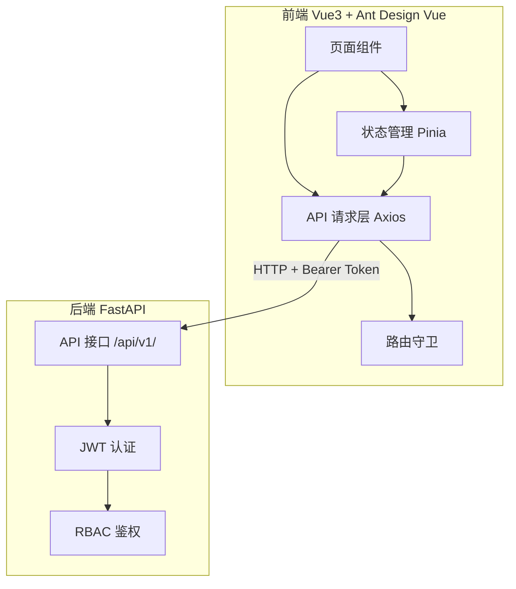

## 1. 架构设计



## 2. 技术说明

- 前端：Vue3 + JavaScript + Ant Design Vue 4.x + Vue Router 4 + Pinia + Axios
- 构建工具：Vite
- 后端：FastAPI（已存在，仅对接 API）
- 认证：JWT Bearer Token，存储在 localStorage

## 3. 路由定义

| 路由 | 用途 | 权限要求 |
|------|------|----------|
| /login | 登录页面 | 无 |
| / | 主布局（含侧边栏） | 已登录 |
| /dashboard | 仪表盘 | 已登录 |
| /system/users | 用户管理 | user:list |
| /system/roles | 角色管理 | role:list |
| /system/permissions | 权限管理 | permission:list |
| /system/menus | 菜单管理 | menu:list |
| /system/departments | 部门管理 | department:list |
| /system/logs | 操作日志 | log:list |

## 4. API 定义

### 4.1 统一响应格式

```javascript
// { code: 200, message: "success", data: {...} }
```

### 4.2 分页响应格式

```javascript
// { items: [], total: 0, page: 1, page_size: 10, total_pages: 0 }
```

### 4.3 认证接口

```javascript
// POST /api/v1/auth/login
// Request: { username, password }
// Response: { access_token, refresh_token, token_type }

// POST /api/v1/auth/refresh
// Request: { refresh_token }
// Response: { access_token, refresh_token, token_type }
```

### 4.4 用户接口

```javascript
// GET /api/v1/users?page=1&page_size=10
// POST /api/v1/users
// Request: { username, email, password, nickname?, phone?, department_id?, role_ids? }
// PUT /api/v1/users/:id
// Request: { email?, nickname?, phone?, avatar?, is_active?, department_id?, role_ids? }
// Response: { id, username, email, nickname, phone, avatar, is_active, department_id, created_at, updated_at }
// DELETE /api/v1/users/:id
```

### 4.5 角色接口

```javascript
// GET /api/v1/roles?page=1&page_size=10
// POST /api/v1/roles
// Request: { name, code, description?, sort?, is_active?, permission_ids?, menu_ids? }
// PUT /api/v1/roles/:id
// Request: { name?, code?, description?, sort?, is_active?, permission_ids?, menu_ids? }
// Response: { id, name, code, description, sort, is_active, created_at, updated_at }
// DELETE /api/v1/roles/:id
```

### 4.6 权限接口

```javascript
// GET /api/v1/permissions?page=1&page_size=10
// POST /api/v1/permissions
// Request: { name, code, description?, module?, action? }
// PUT /api/v1/permissions/:id
// Request: { name?, code?, description?, module?, action? }
// Response: { id, name, code, description, module, action, created_at, updated_at }
// DELETE /api/v1/permissions/:id
```

### 4.7 菜单接口

```javascript
// GET /api/v1/menus/tree
// POST /api/v1/menus
// Request: { name, path?, component?, icon?, menu_type, parent_id?, sort?, visible?, permission? }
// PUT /api/v1/menus/:id
// Response: { id, name, path, component, icon, menu_type, parent_id, sort, visible, permission, created_at, updated_at, children: [] }
// DELETE /api/v1/menus/:id
```

### 4.8 部门接口

```javascript
// GET /api/v1/departments/tree
// POST /api/v1/departments
// Request: { name, code?, parent_id?, sort?, leader?, phone?, status? }
// PUT /api/v1/departments/:id
// Response: { id, name, code, parent_id, sort, leader, phone, status, created_at, updated_at, children: [] }
// DELETE /api/v1/departments/:id
```

### 4.9 日志接口

```javascript
// GET /api/v1/logs?page=1&page_size=10
// Response: { id, user_id, username, method, path, params, status_code, ip, user_agent, duration, message, created_at }
// GET /api/v1/logs/user/:id
```

## 5. 项目目录结构

```
frontend/
├── src/
│   ├── api/              # API 请求模块
│   │   ├── index.js      # Axios 实例与拦截器
│   │   ├── auth.js       # 认证接口
│   │   ├── user.js       # 用户接口
│   │   ├── role.js       # 角色接口
│   │   ├── permission.js # 权限接口
│   │   ├── menu.js       # 菜单接口
│   │   ├── department.js # 部门接口
│   │   └── log.js        # 日志接口
│   ├── components/       # 公共组件
│   ├── composables/      # 组合式函数
│   ├── layouts/          # 布局组件
│   │   └── MainLayout.vue
│   ├── pages/            # 页面组件
│   │   ├── Login.vue
│   │   ├── Dashboard.vue
│   │   ├── UserManage.vue
│   │   ├── RoleManage.vue
│   │   ├── PermissionManage.vue
│   │   ├── MenuManage.vue
│   │   ├── DepartmentManage.vue
│   │   └── LogManage.vue
│   ├── router/           # 路由配置
│   │   └── index.js
│   ├── stores/           # Pinia 状态管理
│   │   ├── auth.js       # 认证状态
│   │   └── app.js        # 应用状态
│   ├── utils/            # 工具函数
│   ├── App.vue
│   └── main.js
├── index.html
├── package.json
├── vite.config.js
└── .env
```
