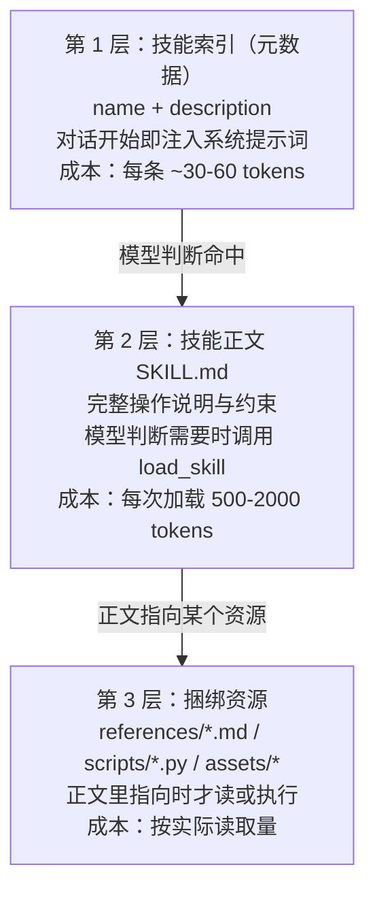
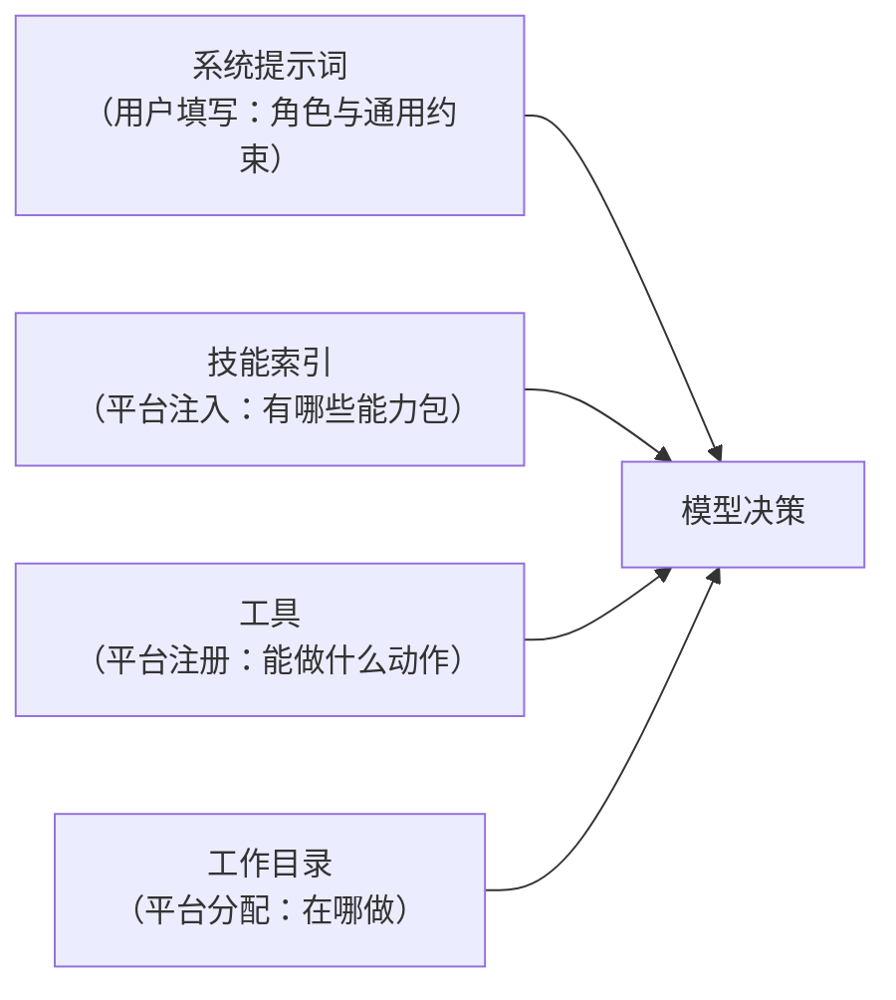
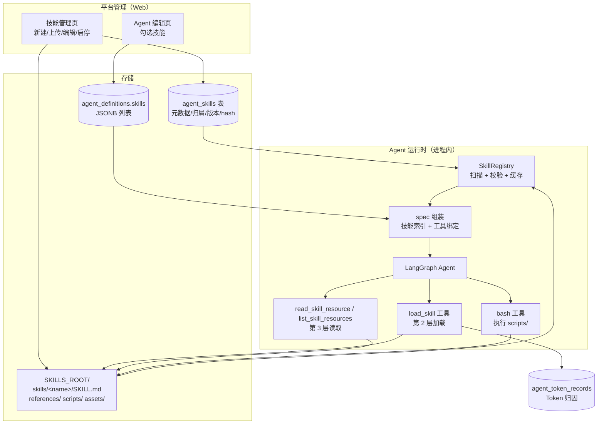
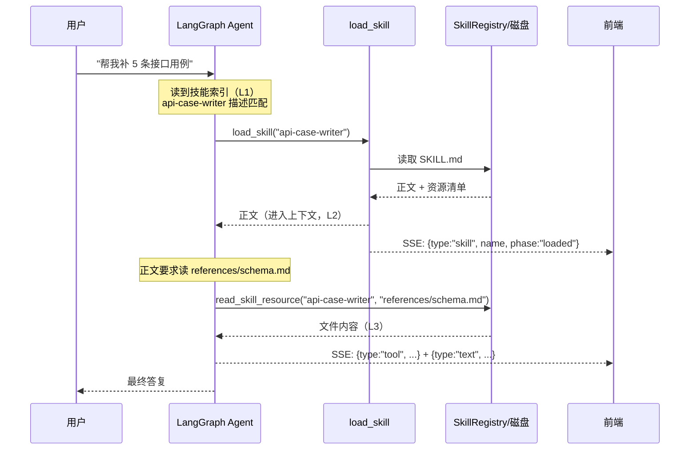
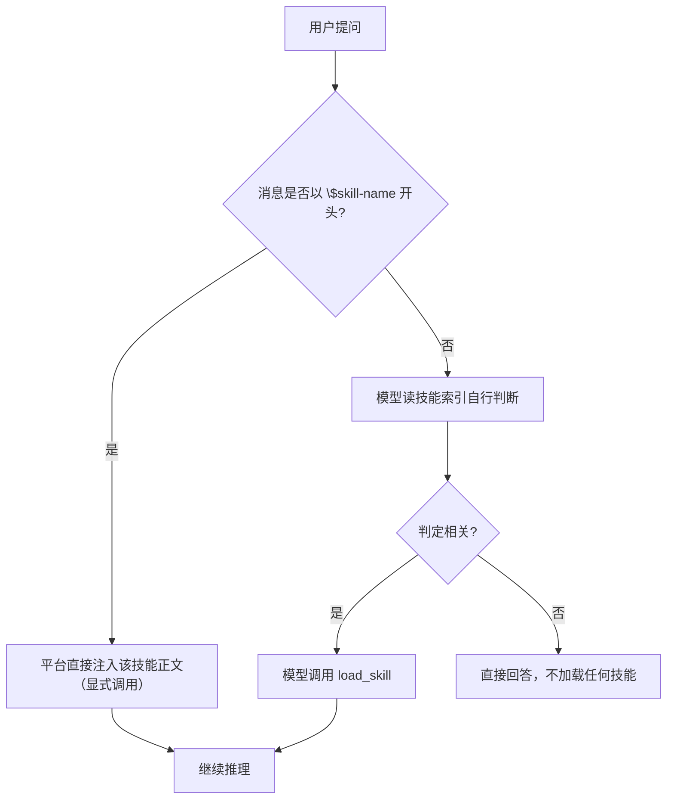

# Agent 技能（Skills）功能设计文档

| 项目 | 内容 |
|------|------|
| 文档版本 | v0.2（评审后更新） |
| 目标版本 | 待定（建议 v1.1.0） |
| 状态 | 设计已评审确认（2026-09-23），**未编码** |
| 评审结论 | §13.2（10 项已确认，无遗留待定项） |
| 关联文档 | [软件设计文档_V1.0.0.md](../软件设计文档_V1.0.0.md)、[Agent模块设计文档.md](Agent模块设计文档.md)、[Agent模块改造方案_V2.md](Agent模块改造方案_V2.md) |
| 编写日期 | 2026-09-23 |

---

## 1. 背景与目标

### 1.1 现状

当前 Agent 模块（V2）已具备以下能力：

| 能力 | 实现位置 |
|------|---------|
| 平台级 LLM 配置（超管维护、密钥加密存储） | `agent_llms` 表 + `AgentLlmService` |
| 用户自建 Agent（选 LLM + 写系统提示词 + 勾选工具） | `agent_definitions` 表 + `AgentDefService` |
| 工具注册与按需装配 | `app/agent/tools/registry.py`（`autodiscover` 扫描 `builtin/`，当前仅 `bash`） |
| 按 Agent 绑定的工作目录（bash 沙箱根） | `app/agent/config.py` + `runtime._bind_tools()` |
| 多轮记忆（PostgreSQL Checkpointer） | `app/agent/memory/checkpointer.py` |
| Token 计量与统计 | `agent_middleware` + `TokenLedger` + `agent_token_records` |
| 流式对话（SSE：text / tool / tool_result / todo / done / error） | `runtime.stream_round()` + `api/v1/agent.py` |
| 配置快照与一致性守卫（hash 变更禁止续聊） | `agent_config_hash()` / `build_snapshot()` |

### 1.2 要解决的问题

现在想给 Agent 增加"领域知识 + 固定流程"，只有两个选择，都不合适：

**选择一：写进系统提示词**

- 每个会话、每一轮都要付出全部 token 成本；
- 提示词越长，模型对其中任一环节的注意力越弱（长上下文稀释）；
- 用户互相冲突的流程无法共存（一个人要 A 流程，另一个人要 B 流程）。

**选择二：做成工具**

- 工具是"原子能力"（一次调用 = 一个动作），无法承载"步骤性知识 + 参考资料 + 脚本"；
- 工具本身没有"何时该用我"的语义，需要靠系统提示词补，又回到选择一；
- 工具描述常驻上下文，多个复杂工具会持续占用注意力。

**本质矛盾**：Agent 需要"很多专业知识"，但上下文窗口和注意力是稀缺资源。

### 1.3 解决方案：技能 + 渐进式披露

引入 **技能（Skill）** 作为"按需加载的能力包"，并用**渐进式披露（Progressive Disclosure）**把
"知道有这个东西"与"知道它的全部细节"解耦：

- 平时只让模型知道**技能名 + 一句话说明**（很便宜）；
- 判断出该用某个技能时，才把该技能的**完整操作说明**读进上下文；
- 说明书里提到的**详细参考资料/脚本**，只在真正需要那一步时才读/执行。

### 1.4 目标

| 编号 | 目标 |
|------|------|
| G1 | Agent 可按需加载技能，技能正文不常驻上下文 |
| G2 | 技能以文件夹形式组织，可捆绑 `references/`、`scripts/`、`assets/` |
| G3 | 支持平台级技能（管理员维护，全员可用）与用户私有技能 |
| G4 | 与现有 Agent 能力正交：不改动 tools 语义，不破坏现有会话 |
| G5 | 全过程可观测：谁加载了哪个技能、花了多少 token |
| G6 | 技能加载过程在对话界面可见（可解释性） |

### 1.5 非目标（本期不做）

- ❌ 技能市场 / 跨团队分享 / 版本升级订阅
- ❌ 技能级独立计费
- ❌ 技能的自动生成（用 LLM 从文档生成技能）
- ❌ 技能的沙箱隔离执行（沿用现有 bash 的边界声明，见 §9.3）
- ❌ 技能内的多 Agent 编排

### 1.6 术语

| 术语 | 含义 |
|------|------|
| Skill（技能） | 一个文件夹，含必需的 `SKILL.md` 与可选的捆绑资源 |
| 技能元数据 | `SKILL.md` frontmatter 里的 `name` 与 `description`（渐进式披露第 1 层） |
| 技能正文 | `SKILL.md` 的 Markdown 内容（第 2 层） |
| 捆绑资源 | `references/`、`scripts/`、`assets/` 下的文件（第 3 层） |
| 技能索引 | 当前 Agent 可用技能的元数据集合，注入系统提示词 |
| 技能加载 | 把某个技能的正文读入当前对话上下文 |
| 渐进式披露 | 元数据 → 正文 → 资源的逐层按需展开 |

---

## 2. 渐进式披露设计模式

### 2.1 三层披露



三层的关键差别在于**加载时机**与**是否常驻**：

| 层级 | 何时进入上下文 | 是否常驻 | 谁决定加载 |
|------|---------------|---------|-----------|
| L1 元数据 | 每轮对话（随系统提示词） | 是 | 平台（构建实例时） |
| L2 正文 | 模型判定需要该技能时 | 是（进入对话历史） | 模型（或用户显式指定） |
| L3 资源 | 正文要求读取/执行时 | 否（可只读其中一部分） | 模型 |

### 2.2 成本对比（为什么必须分层）

假设一个 Agent 挂了 10 个技能，每个技能正文 1500 tokens、资源合计 8000 tokens：

| 方案 | 每轮固定成本 | 命中时的额外成本 |
|------|------------|----------------|
| 全部塞进系统提示词 | ≈ 10 × 1500 = **15000 tokens/轮** | 0 |
| 全部塞进系统提示词（含资源） | ≈ 10 × 9500 = **95000 tokens/轮**（不可行） | 0 |
| **技能 + 渐进式披露** | ≈ 10 × 45 = **450 tokens/轮** | 1500（正文）+ 按需资源 |

结论：常驻成本从"与知识总量成正比"降为"与技能**数量**成正比、与单个技能**体量无关**"。
这直接决定了系统能沉淀多少领域知识而不拖垮每一次对话。

### 2.3 与现有能力的关系



- **技能 ≠ 工具**：技能是"知识与流程"，工具是"动作与副作用"。
- 技能可以**要求使用某个工具**（例如"技能说明：请用 bash 执行 scripts/check_env.py"），
  但技能本身不新增工具权限。
- 技能不替代系统提示词：系统提示词承载"这个 Agent 是谁"，技能承载"遇到某类任务怎么做"。

---

## 3. 总体方案

### 3.1 架构图



### 3.2 关键设计决策

#### 决策 1：技能内容存磁盘，元数据存库（混合方案）

| 方案 | 说明 | 评价 |
|------|------|------|
| A. 全量入库（正文存 TEXT） | 与 `agent_llms` 一致 | ❌ 资源文件（脚本/模板/图片）不适合入库；无法直接执行 |
| B. 全量落盘（仅靠目录扫描） | 简单 | ❌ 无法表达归属、启用状态、版本；列表页每次都要扫盘 |
| **C. 混合（推荐）** | 库=注册表（归属/启用/版本/hash/描述），盘=内容（SKILL.md + 资源） | ✅ 与现有"DB 记录 + 磁盘产物"惯例一致（projects ↔ 代码目录、python_envs ↔ conda 路径） |

#### 决策 2：第 2 层由模型自主触发（工具调用），用户可显式覆盖

| 触发方式 | 说明 | 取舍 |
|---------|------|------|
| A. 模型自主（`load_skill` 工具） | 模型读技能索引后自行判断 | ✅ 与 LangChain 工具调用天然契合，无需额外组件；⚠️ 依赖模型工具调用能力 |
| B. 平台预路由（LLM/向量匹配后再注入正文） | 平台替模型判断 | ⚠️ 每轮多一次判断调用（成本 + 延迟）；MVP 不做 |
| C. 用户显式调用（输入 `$skill-name`） | 用户强指定 | ✅ 与主流 Agent 习惯一致，作为 A 的补充 |

**推荐**：MVP 采用 **A + C**，B 留作 P2 可选增强。

#### 决策 3：资源读取走专用工具，脚本执行复用 bash

| 方式 | 说明 |
|------|------|
| `read_skill_resource(skill, path)` | 读文本类资源（.md/.json/.csv/.txt），带大小上限与截断 |
| `list_skill_resources(skill)` | 列出资源清单（避免模型盲猜文件名） |
| 脚本执行 | **不新增工具**，由技能正文指明"用 bash 执行 scripts/xxx.py"；技能目录对 bash 可见 |

不引入 `run_skill_script` 的理由：新增执行入口就要新增一套审计与超时策略，而 bash 已具备
（黑名单、超时、输出截断、工作目录绑定）。技能脚本与其它命令共用同一风险边界，审计口径统一。

> ⚠️ 前提：技能目录必须落在 Agent 工作目录可访问的范围内（见 §6.4 磁盘布局）。

### 3.3 与现有模块的集成点

| 现有位置 | 改造点 |
|---------|-------|
| `app/config.py` | 新增 `AGENT_SKILLS_ENABLED` / `AGENT_SKILLS_ROOT` / 尺寸上限等配置 |
| `app/agent/config.py` | 新增 `skills_root()` / `resolve_skill_dir()`，与 `workspace_root()` 同构 |
| `app/agent/tools/registry.py` | 复用 `autodiscover`，技能工具放在 `builtin/` 下自动注册 |
| `app/agent/runtime.py` | `_bind_tools()` 绑定技能上下文；`_build_instance()` 注入技能索引；`_stream_events()` 增加 `skill` 事件 |
| `app/services/agent_service.py` | `_compose_spec()` 补技能；`agent_config_hash()` 纳入技能；`_check_tools()` 旁增 `_check_skills()` |
| `app/models/agent_definition.py` | 新增 `skills` JSONB 字段 |
| `app/models/agent_skill.py` | 新增表模型 |
| `app/api/v1/agent.py` + `app/schemas/agent.py` | 技能 CRUD 接口与校验 |
| `backend/scripts/seed_data.py` | 新增 `agent:skill:*` 权限与菜单按钮 |
| `frontend/src/pages/agent/SkillManage.vue` | 新增技能管理页 |
| `frontend/src/pages/agent/Chat.vue` | 新增 `skill` 事件渲染 |
| `backend/alembic/versions/0002_agent_skills.py` | 新增迁移（发布前按 §7.7 约定压扁） |

---

## 4. 技能包规范

### 4.1 目录结构

技能包格式对齐通用 Agent Skills 约定（`SKILL.md` + 可选资源目录），便于后续与外部技能互通：

```text
skills/
└── api-case-writer/            # 技能名（同时也是目录名，需满足命名规则）
    ├── SKILL.md                # 必需：frontmatter + 正文
    ├── references/             # 可选：按需阅读的文档
    │   ├── schema.md
    │   └── style-guide.md
    ├── scripts/                # 可选：可执行脚本
    │   └── validate_cases.py
    └── assets/                 # 可选：生成产物用的模板/图片
        └── case-template.xlsx
```

### 4.2 `SKILL.md` frontmatter

```markdown
---
name: api-case-writer
description: 按团队规范批量编写接口测试用例并导出 CSV；当用户要求"补接口用例""生成用例表"时使用。
version: 1.0.0
allowed-tools: [bash]
metadata:
  owner: 测试平台组
  updated: 2026-09-23
---

# 接口用例编写技能

## 何时使用
...

## 步骤
1. 读取 `references/schema.md` 确认列定义
2. 按 `references/style-guide.md` 编写
3. 用 `bash` 执行 `scripts/validate_cases.py` 校验

## 约束
- 用例编码必须 `test_` 开头
```

| 字段 | 必需 | 说明 |
|------|------|------|
| `name` | ✅ | 技能标识，同时是目录名；`^[a-z0-9][a-z0-9-]{0,62}$` |
| `description` | ✅ | 一句话说明"做什么 + 何时用"；**这是唯一常驻上下文的内容**，建议 20–200 字 |
| `version` | ⭕ | 作者自填，用于展示；平台另有内容 hash 作为真实版本依据 |
| `allowed-tools` | ⭕ | 声明本技能需要的工具，用于校验与提示；MVP 为**声明式校验**（见 §9.5） |
| `metadata.*` | ⭕ | 自由扩展（负责人、更新时间等），平台不解析 |

### 4.3 正文写作约定

渐进式披露的效果**取决于作者怎么写**，因此规范要写进技能管理页的编辑提示：

| 约定 | 说明 |
|------|------|
| 正文保持精简 | 只放"每次用这个技能都要做的事"；上限 `AGENT_SKILL_MAX_BODY_CHARS`（建议 20000 字符），超出拒绝保存 |
| 条件性内容下沉 | 只在某些分支才需要的细节 → 放 `references/`，并在正文用**相对路径链接 + 何时读它**指明 |
| 明确引用方式 | 正文写 `需要时读取 references/schema.md`，而不是把 schema 抄进正文 |
| 脚本给确定性 | 重复且易错的计算/转换 → 放 `scripts/`，正文只写"执行它、期望输出是什么" |
| 不写通用常识 | 模型已知的通用做法不写，避免浪费 token（与 skill 写作原则一致） |

### 4.4 校验规则

创建/更新技能时校验（失败即拒绝，错误信息面向作者）：

| 项 | 规则 |
|----|------|
| 技能名 | `^[a-z0-9][a-z0-9-]{0,62}$`；不重名（见 §6.1 唯一性）；禁止 `..`、`/`、空名 |
| description | 非空，长度 10–500 字符 |
| 正文 | 非空，长度 ≤ `AGENT_SKILL_MAX_BODY_CHARS` |
| frontmatter | 必须是合法 YAML；`name` 必须与目录名/注册名一致 |
| 资源 | 单文件 ≤ `AGENT_SKILL_MAX_RESOURCE_BYTES`（建议 5MB）；文件数 ≤ `AGENT_SKILL_MAX_FILES`；禁止符号链接 |
| 路径 | 所有相对路径经 `resolve()` 后必须落在该技能目录内（复用项目现有的 `_is_safe_path` 思路） |
| 打包上传 | zip 体积/解压体积/条目数上限，复用 `project_init_service` 的校验清单 |

### 4.5 示例定义

一个用于"生成测试计划 AI 汇总报告"的技能（与本项目业务贴合）：

```text
skills/plan-report-style/
├── SKILL.md
└── references/
    └── report-template.md
```

```markdown
---
name: plan-report-style
description: 按公司模板撰写测试计划执行汇总报告；当需要把计划用例结果汇总成对外报告时使用。
---

# 测试报告撰写技能

## 输出要求
1. 先给出结论（通过率、阻塞项、风险）
2. 再给失败用例明细（标题 + 失败原因摘要）
3. 最后给建议（按优先级排序，最多 5 条）

格式模板见 `references/report-template.md`，**必须**按其中的段落顺序组织。

## 约束
- 用例标题原样引用，不要改写
- 失败原因只保留最关键的一行
- 不臆测未执行的用例结果
```

---

## 5. 运行时设计（渐进式披露落地）

### 5.1 第 1 层：技能索引注入

**注入位置**：`runtime._build_instance()` 组装系统提示词时，由 `spec["skills"]` 生成索引段落，
追加到用户填写的系统提示词之后（用户提示词负责"我是谁"，技能索引负责"我有哪些能力包"）。

**提示词模板**（追加段，全文见 §14.1）：

```text
## 可用技能（Skills）

技能是按需加载的能力包：需要时先用 load_skill 读取其完整说明，再按说明执行。
不要凭技能名猜测用法；不要加载与当前任务无关的技能。

- api-case-writer: 按团队规范批量编写接口测试用例并导出 CSV；当用户要求"补接口用例""生成用例表"时使用。
- plan-report-style: 按公司模板撰写测试计划执行汇总报告；当需要把计划用例结果汇总成对外报告时使用。
```

要求：

- **只注入已启用且通过校验**的技能；
- 按名称排序，保证同一配置下提示词稳定（利于 prompt 缓存）；
- 技能为空时不注入该段落（保持与现状完全一致，零影响）。

### 5.2 第 2 层：技能正文加载

**工具契约**：

```python
@tool
def load_skill(skill_name: str) -> str:
    """读取指定技能的完整操作说明。仅当技能索引显示它与当前任务相关时调用。"""
```

| 项 | 约定 |
|----|------|
| 入参 | `skill_name`：必须来自技能索引，不在索引内 → 返回错误文本（不抛异常，让模型自行纠正） |
| 出参 | 技能正文全文 + 资源清单（只列文件名与用途，**不返回文件内容**） |
| 权限 | 只能加载本 Agent 已启用的技能 |
| 副作用 | 无（纯读取） |
| 尺寸 | 超出 `AGENT_SKILL_MAX_BODY_CHARS` 的正文在入库时已被拒绝，运行时无需再截断 |

**加载时序**：



### 5.3 第 3 层：资源访问

```python
@tool
def list_skill_resources(skill_name: str) -> str:
    """列出技能的捆绑资源（路径 + 大小），用于确认文件名，避免猜测。"""

@tool
def read_skill_resource(skill_name: str, path: str) -> str:
    """读取技能内的文本资源，例如 references/schema.md。二进制资源请用 bash 处理。"""
```

| 项 | 约定 |
|----|------|
| 路径安全 | `path` 必须是相对路径；拼接后 `resolve()` 必须位于该技能目录内，否则拒绝 |
| 白名单扩展名 | `.md/.txt/.json/.yaml/.yml/.csv/.py/.sql`（其余走 bash，避免把二进制灌进上下文） |
| 大小上限 | `AGENT_SKILL_MAX_RESOURCE_BYTES`；超出则截断并标注"已截断" |
| 内容清洗 | 去掉可能的 ANSI 控制字符；不改写内容（保留原始格式） |
| 脚本执行 | 不在本工具内执行。技能正文需写明"用 bash 执行 `scripts/xxx.sh`" |

> **脚本路径问题**：bash 的工作目录是 Agent 的 workspace（`user_<uid>/agent_<aid>`），
> 与技能目录不在同一棵树。两种解法（见 §6.4）：
> **(a) 符号链接/复制**：把技能目录以只读方式挂到 workspace 下的 `skills/`；
> **(b) 绝对路径**：技能正文使用 `SKILLS_ROOT/<name>/scripts/x.py` 绝对路径。
> 推荐 (a)：路径短、稳定、且能通过 workspace 的越界校验。

### 5.4 触发策略



显式调用的处理位置：`AgentService.prepare_stream()` / `send_message()` 解析用户消息开头的
`$skill-name`，校验该技能已启用后，把正文作为一次性提示前缀注入（并在消息记录中保留原文，
便于前端展示）。这样即使模型工具调用能力较弱，用户也能强制使用某技能。

### 5.5 上下文与 Token 管理

| 关注点 | 设计 |
|--------|------|
| 计量 | 技能加载本身不调用 LLM，但其带来的输入 token 会体现在**下一轮**的 `usage` 中，现有 `agent_token_records` 自动覆盖 |
| 重复加载 | **不做去重**（评审结论）：同一轮内由模型自行避免重复加载；若发生重复加载，正文会重复进入上下文，代价由技能作者通过控制正文长度兜底。后续如确有需要，可作为独立优化项再评估 |
| 超长正文 | 入库时限制，不在运行时截断（作者被告知拆分） |
| 技能过多 | **不设硬上限**（评审结论）：勾选界面实时展示"已选 N 个技能 ≈ M tokens/轮"的估算，超过 20 个给出提示；运行时不做数量校验 |
| 与历史消息的关系 | 技能正文作为工具结果进入消息历史，随 Checkpointer 持久化，重开会话仍在 → 这是"加载即常驻"的代价，符合渐进式披露的设计前提 |

### 5.6 与实例缓存 / 配置快照的关系

这是**最容易踩坑的一点**，必须显式设计：

| 机制 | 现状 | 加入技能后 |
|------|------|-----------|
| 实例缓存 `_get_or_build` | 按 `agent_id` + `hash` 命中 | 技能集或技能内容变化 → hash 必须变化 → 重建实例 |
| `agent_config_hash()` | `llm.id\|provider\|model\|base_url\|system_prompt\|tools\|workspace` | 追加 `skills`（名称+内容 hash，排序后） |
| 会话一致性守卫 | hash 不一致 → 禁止续聊 | 技能内容变更也会让老会话失效 → 需明确提示文案 |
| `build_snapshot()` | 记录 Agent 配置快照 | 追加技能清单 + 各自版本，便于追溯"这轮用的是哪个版本的技能" |

**兼容性处理（重要）**：直接往 hash 里追加字段会让**所有存量会话**因"配置已变更"被拒绝续聊。推荐：

```python
def agent_config_hash(agent, llm):
    """Agent 运行配置指纹：LLM 字段 + 提示词 + 工具 + 工作目录（+ 技能）"""
    parts = [
        str(llm.id), llm.provider or "", llm.model or "", llm.base_url or "",
        agent.system_prompt or "",
        json.dumps(sorted(agent.tools or []), ensure_ascii=False),
        agent.workspace or "",
    ]
    # 未启用技能的 Agent 不追加技能段：保持旧指纹算法，存量会话不受影响
    if agent.skills:
        parts.append(json.dumps(_skill_signatures(agent.skills), ensure_ascii=False))
    return hashlib.md5("|".join(parts).encode("utf-8")).hexdigest()
```

- 未使用技能的 Agent → 命中旧 hash 算法，**存量会话不受影响**；
- 启用了技能的 Agent → 走新算法，技能变更即时生效（新会话）。

---

## 6. 数据模型设计

### 6.1 新增表 `agent_skills`

```python
class AgentSkill(BaseModel):
    """技能注册表：元数据入库，内容（SKILL.md + 资源）落盘。

    - owner_id 为 NULL 表示平台级技能（仅超管可维护，全员可用）
    - name 为技能标识，同时是磁盘目录名；创建后不可修改（与 python_envs.name 同规则）
    - content_hash 为技能目录内容的指纹，用于实例重建判定与会话追溯
    """
    __tablename__ = "agent_skills"

    owner_id: Mapped[int | None] = mapped_column(
        Integer, ForeignKey("users.id", ondelete="CASCADE"), index=True, nullable=True
    )
    name: Mapped[str] = mapped_column(String(64), nullable=False)
    description: Mapped[str] = mapped_column(String(500), nullable=False)
    dir_path: Mapped[str] = mapped_column(String(500), nullable=False)
    version: Mapped[str | None] = mapped_column(String(30), nullable=True)
    content_hash: Mapped[str] = mapped_column(String(64), nullable=False)
    file_count: Mapped[int] = mapped_column(Integer, default=0, nullable=False)
    total_bytes: Mapped[int] = mapped_column(Integer, default=0, nullable=False)
    enabled: Mapped[bool] = mapped_column(Boolean, default=True, nullable=False)
    created_by: Mapped[int | None] = mapped_column(
        ForeignKey("users.id", ondelete="SET NULL"), nullable=True
    )
```

| 字段 | 说明 |
|------|------|
| `owner_id` | NULL = 平台级；否则为私有技能归属用户 |
| `name` | 技能标识 / 目录名，唯一性见下 |
| `description` | 从 frontmatter 解析后**冗余存一份**，列表页无需扫盘即可展示 |
| `dir_path` | 技能目录绝对路径，由 `AGENT_SKILLS_ROOT + 归属 + name` 推导 |
| `content_hash` | 目录内容指纹（相对路径 + 文件字节的 md5），用于变更检测与缓存失效 |
| `version` | frontmatter 里的作者自填版本，**仅展示**；平台不做版本管理/历史/回滚（评审结论），真实变更依据是 `content_hash` |
| `file_count` / `total_bytes` | 上传/保存时统计，用于列表展示与容量治理 |
| `enabled` | 停用后不参与任何 Agent 的技能索引 |

**唯一性约束（含 PostgreSQL NULL 陷阱）**：

`owner_id` 为 NULL 时，普通 `UNIQUE(owner_id, name)` **约束不到平台级技能**（PG 中 NULL 互不相等）。
沿用项目已有解法（`testcase_modules` 的同级唯一索引）改用表达式索引：

```python
op.create_index(
    "ux_agent_skills_owner_name",
    "agent_skills",
    [sa.text("COALESCE(owner_id, 0)"), sa.text("name")],
    unique=True,
)
```

**跨作用域重名规则**：平台级与私有技能可各自存在同名记录，但**同一 Agent 只能启用其中一个**——
启用时若解析出的可用技能集合内出现同名，直接报错提示改名，避免"到底加载了哪个"的歧义。

**可见范围（评审结论）**：平台级技能全员可读、仅超管可写；私有技能**仅作者本人（与超管）可读可用**，
不提供"分享给指定用户/角色"的能力（已移出路线图）。因此普通用户上传的技能脚本只会在其本人
创建的 Agent 中执行，不会进入他人的运行环境。

### 6.2 `agent_definitions` 增加技能列表

```python
# 勾选的技能名列表（与 tools 同构：存名称，便于阅读与排错）
skills: Mapped[list] = mapped_column(JSON, default=list, nullable=False)
```

选**名称列表**而非 ID 列表：与现有 `tools` 字段完全同构，前端与快照可读性好；
代价是技能不可改名（与 `python_envs.name`、工具名的既有约定一致）。

### 6.3 迁移脚本

新增 `backend/alembic/versions/0002_agent_skills.py`，`down_revision = "0001_v1_0_0_initial"`：

```python
def upgrade() -> None:
    op.create_table("agent_skills", ...)
    op.create_index("ix_agent_skills_owner_id", "agent_skills", ["owner_id"])
    op.create_index("ix_agent_skills_enabled", "agent_skills", ["enabled"])
    op.create_index(
        "ux_agent_skills_owner_name", "agent_skills",
        [sa.text("COALESCE(owner_id, 0)"), sa.text("name")], unique=True,
    )
    op.add_column(
        "agent_definitions",
        sa.Column("skills", sa.JSON(), nullable=False, server_default=sa.text("'[]'")),
    )


def downgrade() -> None:
    op.drop_column("agent_definitions", "skills")
    op.drop_index("ux_agent_skills_owner_name", table_name="agent_skills")
    op.drop_index("ix_agent_skills_enabled", table_name="agent_skills")
    op.drop_index("ix_agent_skills_owner_id", table_name="agent_skills")
    op.drop_table("agent_skills")
```

> 按 [软件设计文档_V1.0.0.md](../软件设计文档_V1.0.0.md) §7.7 的既有约定：发布前把该迁移压扁进
> `0001_v1_0_0_initial`，保持"全新安装 = 一次建表"。

### 6.4 磁盘布局与路径安全

```text
{AGENT_SKILLS_ROOT}/                  # 新增配置，默认 backend/agent_skills
├── platform/                         # 平台级技能（超管维护，全员可用）
│   ├── api-case-writer/
│   │   ├── SKILL.md
│   │   └── references/schema.md
│   └── plan-report-style/
└── user_<uid>/                       # 用户私有技能
    └── my-skill/
        └── SKILL.md
```

**与 Agent workspace 的衔接**（脚本执行的前提）：

```text
{AGENT_WORKSPACE_ROOT}/
└── user_<uid>/agent_<aid>/           # 现有：bash 工作目录
    ├── （Agent 自己的文件）
    └── skills/                       # 新增：该 Agent 启用技能的副本
        ├── .synced_hash              # 记录同步时的技能内容指纹
        └── api-case-writer/
            ├── SKILL.md
            └── scripts/validate_cases.py
```

同步策略（`_sync_agent_skills(workspace, skills)`，在实例构建时执行）：

| 方案 | 说明 | 选择 |
|------|------|------|
| 符号链接 | 磁盘零拷贝 | ❌ Windows 需开发者模式/管理员权限，跨平台不稳 |
| **按 hash 增量复制（推荐）** | 目标 `.synced_hash` 与技能 `content_hash` 一致则跳过；否则整目录重刷 | ✅ 跨平台稳定，技能目录对 bash 天然可见 |
| 绝对路径引用 | 技能正文直接写 `{SKILLS_ROOT}/.../scripts/x.py` | ⭕ 备选：路径长，仍需越界校验 |

路径安全（复用项目既有做法）：

1. 所有拼接路径 `resolve()` 后必须落在 `{AGENT_SKILLS_ROOT}` 或目标技能目录内（防 `../` 越界）；
2. zip 上传校验复用 `project_init_service.inspect_zip` 的思路：拒绝绝对路径、盘符、`..`、符号链接、
   重名条目与噪音条目，并限制条目数与解压体积；
3. 复制到 workspace 时跳过符号链接，且不得写入 `skills/` 之外的任何路径。

---

## 7. 后端实现设计

### 7.1 文件改造清单

| 文件 | 类型 | 改造内容 |
|------|------|---------|
| `app/models/agent_skill.py` | 新增 | `AgentSkill` 模型 |
| `app/models/agent_definition.py` | 修改 | 增加 `skills` 字段 |
| `app/models/__init__.py` | 修改 | 导出 `AgentSkill` |
| `app/agent/skills/registry.py` | 新增 | `SkillRegistry`：元数据缓存 + 磁盘读写 + 内容 hash |
| `app/agent/skills/spec.py` | 新增 | 技能索引提示词生成、技能签名计算 |
| `app/agent/skills/sync.py` | 新增 | 技能目录 → workspace 增量同步 |
| `app/agent/tools/builtin/skill_tools.py` | 新增 | `load_skill` / `list_skill_resources` / `read_skill_resource` |
| `app/agent/config.py` | 修改 | `skills_root()` / `resolve_skill_dir()` |
| `app/agent/runtime.py` | 修改 | 绑定技能工具、注入技能索引、新增 `skill` 流式事件 |
| `app/services/skill_service.py` | 新增 | 技能 CRUD / 上传解包 / 校验 |
| `app/services/agent_service.py` | 修改 | 技能校验、spec/hash/快照纳入技能、`$skill` 显式触发 |
| `app/api/v1/agent.py` | 修改 | 技能 CRUD 与资源读取接口 |
| `app/schemas/agent.py` | 修改 | 技能相关 Pydantic 模型 |
| `app/config.py` | 修改 | 技能总开关与限额配置 |
| `backend/scripts/seed_data.py` | 修改 | `agent:skill:*` 权限与菜单按钮 |
| `backend/alembic/versions/0002_agent_skills.py` | 新增 | 迁移 |

### 7.2 `SkillRegistry` 设计

与 `ToolRegistry`（`app/agent/tools/registry.py`）风格一致，但职责不同：ToolRegistry 是**静态进程级**的
（平台有哪些工具）；SkillRegistry 面向**动态数据**（有哪些技能、内容是什么），因此需要缓存。

```python
class SkillRegistry:
    """技能注册表：DB 元数据 + 磁盘内容，进程级缓存。

    缓存键为 skill_id，值为 (content_hash, SkillMeta)；hash 变化时自动重读。
    失效入口：技能增删改后由 service 调用 invalidate()；多 worker 下以
    DB 中的 content_hash 为准做兜底校验，保证最终一致。
    """

    def list_for_agent(self, names: list[str], user_id: int, is_superuser: bool) -> list[SkillMeta]: ...
    def read_body(self, meta: SkillMeta) -> str: ...
    def list_resources(self, meta: SkillMeta) -> list[ResourceInfo]: ...
    def read_resource(self, meta: SkillMeta, rel_path: str) -> str: ...
    def invalidate(self, skill_id: int | None = None) -> None: ...
```

在 `runtime.py` 中与工具注册表并列初始化：

```python
_registry = ToolRegistry()
_registry.autodiscover("app.agent.tools.builtin")
skill_registry = SkillRegistry()
```

### 7.3 服务层改造要点

**（1）技能校验**（与既有 `_check_tools()` 并列）：

```python
async def _check_skills(self, skills: list[str]) -> None:
    """校验技能可用：存在、已启用、在调用者可见范围内、无重名歧义"""
```

**（2）spec 组装**（扩展 `_compose_spec()`）：

```python
return {
    ...现有字段...,
    # 技能索引：只有元数据，正文不在这里（渐进式披露第 1 层）
    "skills": [
        {"name": m.name, "description": m.description, "dir": str(m.dir_path)}
        for m in skill_registry.list_for_agent(agent.skills or [], agent.user_id, is_superuser)
    ],
}
```

**（3）配置指纹**：见 §5.6；`_skill_signatures(names)` 返回 `[(name, version, content_hash)]`。

**（4）会话快照**：`build_snapshot()` 增加 `"skills"` 段（名称 + 版本 + 内容 hash），
用于追溯"这条会话当时用的是哪个版本的技能"。

**（5）显式触发**：`prepare_stream()` / `send_message()` 解析消息开头的 `$skill-name`，
校验后把技能正文作为一次性前缀注入；消息原文照常落库，前端仍能看到用户输入的 `$skill-name`。

### 7.4 技能工具实现

```python
# app/agent/tools/builtin/skill_tools.py
SKILL_TOOL_NAMES = ("load_skill", "list_skill_resources", "read_skill_resource")


def build_skill_tools(skill_ctx: SkillContext) -> list[BaseTool]:
    """按 Agent 的技能上下文构建绑定后的技能工具（与 build_bash_tool(workspace) 同模式）"""
```

工具契约：

| 工具 | 入参 | 出参 | 失败语义 |
|------|------|------|---------|
| `load_skill` | `skill_name` | 正文全文 + 资源清单（只列文件名，不含内容） | 未找到/未启用 → 返回可读错误文本，不抛异常 |
| `list_skill_resources` | `skill_name` | `路径 / 大小 / 类型` 列表 | 同上 |
| `read_skill_resource` | `skill_name`、`path` | 文件内容（超限截断并标注） | 路径越界/扩展名不允许/文件过大 → 错误文本 |

工具 docstring 必须写清"何时调用"（工具描述同样常驻上下文），全文见 §14.2。

### 7.5 API 设计

全部挂在既有 `/api/v1/agent` 前缀下：

| 方法 | 路径 | 权限 | 说明 |
|------|------|------|------|
| GET | `/agent/skills` | `agent:skill:list` | 技能列表（分页；支持 `scope` / `enabled` / 关键字筛选） |
| GET | `/agent/skills/options` | 仅登录 | 下拉选项（供 Agent 编辑页勾选），字段精简 |
| GET | `/agent/skills/{id}` | `agent:skill:detail` | 技能详情（含 frontmatter 解析结果） |
| POST | `/agent/skills` | `agent:skill:create` | 内联新建（name + description + 正文 → 生成 SKILL.md） |
| PUT | `/agent/skills/{id}` | `agent:skill:update` | 编辑描述/正文（`name` 不可改） |
| PATCH | `/agent/skills/{id}/toggle` | `agent:skill:update` | 启用 / 停用 |
| DELETE | `/agent/skills/{id}` | `agent:skill:delete` | 删除（同时清理磁盘目录） |
| POST | `/agent/skills/upload` | `agent:skill:create` | 上传 zip 技能包（新建，或覆盖同名私有技能） |
| GET | `/agent/skills/{id}/resources` | `agent:skill:detail` | 资源树（路径 / 大小 / 类型） |
| GET | `/agent/skills/{id}/resources/content` | `agent:skill:detail` | 预览文本资源（`path` 为查询参数） |
| GET | `/agent/skills/{id}/download` | `agent:skill:detail` | 打包下载技能目录（zip） |

权限归属：

| 技能归属 | 可读 | 可写 |
|---------|------|------|
| 平台级（`owner_id IS NULL`） | 所有登录用户 | 仅超管 |
| 私有（`owner_id = 当前用户`） | 本人 + 超管 | 本人 + 超管 |

API 密钥不开放技能管理接口（与 `agent:llm:*` 一致，`require_permissions` 仅接受 JWT）。

### 7.6 权限与种子数据

按既有 `_ensure_agent_module()` 的写法追加：

```python
AGENT_SKILL_PERMISSIONS = [
    {"name": "技能列表", "code": "agent:skill:list",   "module": "agent", "action": "skill:list"},
    {"name": "技能详情", "code": "agent:skill:detail", "module": "agent", "action": "skill:detail"},
    {"name": "新增技能", "code": "agent:skill:create", "module": "agent", "action": "skill:create"},
    {"name": "编辑技能", "code": "agent:skill:update", "module": "agent", "action": "skill:update"},
    {"name": "删除技能", "code": "agent:skill:delete", "module": "agent", "action": "skill:delete"},
]
```

菜单：挂到既有「AI 助手」目录（`/agent`）下，新增菜单「技能管理」（`/agent/skills`，权限 `agent:skill:list`）
及其按钮（新增 / 编辑 / 删除）。`user` 角色默认仅获得 `:list` 权限与非按钮菜单，与现有授权口径一致。

---

## 8. 前端设计

### 8.1 技能管理页 `pages/agent/SkillManage.vue`

```text
┌──────────────────────────────────────────────────────────────────┐
│ 技能管理                 [上传技能包]  [新建技能]  [刷新]         │
├──────────────────────────────────────────────────────────────────┤
│ 作用域: (全部/平台/我的)   状态: (全部/启用/停用)   关键字: [   ] │
├────┬───────────────────┬─────────────────────────┬──────┬──────┤
│ ID │ 技能名             │ 描述（何时使用）         │ 大小 │ 操作 │
│ 1  │ api-case-writer   │ 按团队规范编写接口用例…  │ 12KB │ ⋯    │
│ 2  │ plan-report-style │ 按公司模板撰写报告…      │ 3KB  │ ⋯    │
└────┴───────────────────┴─────────────────────────┴──────┴──────┘

详情抽屉（右侧）
┌────────────────────────────────────────────┐
│ api-case-writer          [启用/停用] [保存] │
│ 描述: [__________________________________] │
│ SKILL.md 正文（Markdown 编辑器）            │
│ ┌────────────────────────────────────────┐ │
│ │ # 接口用例编写技能                      │ │
│ │ ## 何时使用 ...                         │ │
│ └────────────────────────────────────────┘ │
│ 资源: references/schema.md (2.1KB)         │
│       scripts/validate_cases.py (1.4KB)    │
│ [打包下载]                                  │
└────────────────────────────────────────────┘
```

交互要点：

- **两种创建方式**：内联新建（只填 `name` + `description` + 正文，适合简单技能）/ 上传 zip（适合带资源的技能）；
- 正文编辑器旁固定展示编写规范提示（§4.3），保存前做长度与 frontmatter 校验；
- 资源区为**只读预览**（MVP 不做在线编辑脚本），非文本资源仅展示大小；
- 平台级技能对非超管**只读**（按钮按 `v-permission` 隐藏）。

### 8.2 Agent 编辑页 `pages/agent/AgentManage.vue`

在既有"工具"选择器旁增加"技能"选择器：

```text
技能   [请选择技能                                ▾]
       ┌────────────────────────────────────────────┐
       │ 搜索技能...                      已选 2/20 │
       ├────────────────────────────────────────────┤
       │ [x] api-case-writer      平台 · 按团队规范… │
       │ [x] plan-report-style    平台 · 按公司模板… │
       │ [ ] my-private-skill     我的 · 内部约定…   │
       └────────────────────────────────────────────┘
```

- 选项来自 `GET /agent/skills/options`，标注作用域标签（平台 / 我的）；
- 不限制勾选数量，但实时展示索引成本估算（如"已选 3 个技能 ≈ 150 tokens/轮"），超过 20 个时给出黄色提示；
- 若技能名与已注册工具名重名（例如技能取名 `bash`），仅显示提示文案，不阻断保存（评审结论：只做提示）；
- 保存时若出现重名歧义，后端返回明确错误（见 §6.1）。

### 8.3 对话页 `pages/agent/Chat.vue`

现有 SSE 渲染逻辑（`switch (ev.type)`）新增一个分支：

```javascript
case 'skill': {
  // { type: "skill", name, description, phase: "loading" | "loaded" }
  msg.parts.push({ type: 'skill', name: ev.name, description: ev.description, phase: ev.phase })
  break
}
```

渲染形态（默认折叠，避免长正文刷屏）：

```text
┌────────────────────────────────────────────┐
│ 已加载技能 api-case-writer        [展开 ▾]  │
│   按团队规范批量编写接口测试用例并导出 CSV   │
└────────────────────────────────────────────┘
```

- 折叠态显示技能名与 description；
- 展开态显示该次加载的正文（从消息历史里取，无需新增接口）；
- 会话头部可显示"本次对话已加载 N 个技能"。

### 8.4 路由、菜单与 API 封装

| 文件 | 改造 |
|------|------|
| `frontend/src/router/index.js` | 新增路由 `agent/skills` → `agent/SkillManage.vue`（标题"技能管理"） |
| `frontend/src/api/agent.js` | 新增 `listSkills / getSkill / createSkill / updateSkill / toggleSkill / deleteSkill / uploadSkill / listSkillResources / previewSkillResource / downloadSkill / getSkillOptions` |
| 侧边栏菜单 | 由后端 `menus` 驱动，无需前端硬编码（新增菜单记录即生效） |

---

## 9. 安全设计

### 9.1 威胁模型

| 风险 | 说明 | 缓解 |
|------|------|------|
| **可执行代码** | `scripts/` 下是任意代码，由 bash 执行 | 与 bash 同风险边界：黑名单 + 超时 + 输出截断；生产建议容器化（§9.3） |
| **提示词注入** | 技能正文进入模型上下文，可能试图覆盖系统指令或诱导越权 | 平台技能仅超管可维护（不做审核流程）；私有技能仅作者自用；技能内容不参与任何服务端判定（§9.6） |
| **越权读取** | 构造路径读取技能目录之外的文件 | 路径 `resolve()` 越界校验 + 扩展名白名单 + 目录内约束（§9.2） |
| **资源耗尽** | 超大技能包 / 超多技能撑爆上下文 | 上传与内容限额 + 单次读取截断 + 索引成本可见（不设技能数硬上限，见 §10.1） |

### 9.2 上传与路径安全

直接复用 `project_init_service` 已验证的校验思路，不另起一套：

1. 仅接受 `.zip`，流式落盘并按 `AGENT_SKILL_UPLOAD_MAX_MB` 限制大小；
2. 解压前检查条目数与解压总体积（防 zip bomb）；
3. 拒绝绝对路径、盘符前缀、含 `..` 的条目、符号链接与重名条目；
4. 忽略系统噪音条目（`__MACOSX`、`.DS_Store`、`Thumbs.db` 等）；
5. 顶层必须且只能有一个技能目录，且该目录内必须有 `SKILL.md`，否则提示"请把技能文件夹整体打包上传"；
6. 先解压到 staging 完成全部校验，再投放到 `{AGENT_SKILLS_ROOT}`（失败不留半成品）。

### 9.3 执行隔离（重要边界声明）

> 技能脚本的执行能力**等同**于现有 bash 工具：黑名单只是"拦住明显误操作"的护栏，**不是安全沙箱**。

因此：

- 技能脚本与 Agent 的 bash 共享同一工作目录、同一超时、同一输出截断策略；
- **已确认允许普通用户上传含 `scripts/` 的技能**；由于技能不可分享（私有技能仅作者本人可用），
  风险面被限制在作者自己的 Agent 工作目录内，不会扩散到其他用户；
- 若将来要开放"技能共享 / 把普通用户的技能收录为平台技能"，必须**先**把执行环境迁移到
  容器 / 低权限用户下运行，否则不应开放该能力——这是该场景的准入前置条件，而非可选优化。

### 9.4 权限与归属

| 主体 | 权限 |
|------|------|
| 超管 | 维护平台级技能（创建 / 编辑 / 删除 / 启停） |
| 普通用户 | 维护自己的私有技能；只能启用"平台级 + 自己私有"范围内的技能 |
| API 密钥 | ❌ 不开放技能管理接口（与 `agent:llm:*` 一致，`require_permissions` 仅接受 JWT） |

**评审结论：不做技能审核流程。** 平台级技能仅超管可维护，超管自身的权限约束即作为质量兜底；
不引入 draft / published 之类的审核状态机，避免增加流程成本。平台技能一旦启用，会进入
所有用户的 Agent 可选清单，这一点由超管在维护时自行把关。

### 9.5 `allowed-tools` 与重名提示

MVP 采用**声明式校验**，不做运行时强制：

- 创建 / 编辑技能时，校验 `allowed-tools` 里的名字是否在平台已注册工具集合内（防止拼写错误）；
- 启用技能时，若其声明需要 bash 而当前 Agent 未启用 bash，前端给出警告并记录日志；
- P2 可升级为运行时强制：加载技能后按交集重建实例。这会引起实例缓存重建，
  需先评估多轮对话中的成本与收益再实施。

**技能名与工具名重名（评审结论：只做提示）**：当技能名与平台已注册工具名相同（例如技能取名 `bash`）时，
仅在前端保存/勾选时显示提示文案并记录日志，**不阻断**保存与启用——两者命名空间不同，
模型分别通过"技能索引"与"工具列表"感知，实际不会混淆。

### 9.6 提示词注入的边界

把技能正文视为**与系统提示词同等信任级**的内容，因此：

1. 技能内容**不能**改变平台侧任何判定——权限、工具白名单、路径校验都在服务端代码里，与提示词无关；
2. 技能不能访问未授权数据：模型能接触什么，仍由工具与 workspace 决定；
3. 私有技能只在作者自己的会话生效，作者对自己写的内容负责；
4. 平台技能建议在 `metadata` 中记录负责人，便于问题追溯。

---

## 10. 非功能设计

### 10.1 性能与容量

| 项 | 设计值 | 说明 |
|----|-------|------|
| 技能正文上限 | 20000 字符 | 超出拒绝保存，强制作者拆分到 `references/` |
| description 长度 | 10–500 字符 | 直接决定第 1 层的常驻成本 |
| 单资源读取上限 | 1MB（超出截断） | 防止把大文件灌进上下文 |
| 单个技能包 | 上传 20MB / 解压 100MB / 文件数 1000 | 配置化 |
| 每 Agent 技能数 | **不设硬上限** | 评审结论：不做强制限制；勾选界面展示索引成本估算，超过 20 个给出提示 |
| 技能总数 | 平台级 200 / 每用户 50（仅作上传侧保护，可配置） | 列表分页查询，不做全盘扫描 |
| 索引注入成本 | ≈ 每技能 40–60 tokens | 20 个技能 ≈ 1000 tokens/轮；不设上限时由使用者按估算自行权衡 |
| 磁盘读取 | 缓存 `SkillMeta` 与正文，按 mtime/hash 失效 | 每轮不重复读盘 |

### 10.2 并发与一致性

| 场景 | 机制 |
|------|------|
| 多 Worker 下的技能元数据 | **DB 为唯一事实来源**：spec 组装时按需查询；进程内缓存只做加速，命中后仍与 `content_hash` 比对 |
| 技能内容变更 | 变更即重算 `content_hash`；Agent 的 `agent_config_hash` 随之变化 → 实例自动重建 |
| workspace 技能副本 | 以 `.synced_hash` 为标记做增量同步，避免每次构建都整目录复制 |
| 同一技能被多个 Agent 使用 | 各自 workspace 一份副本，互不影响（用磁盘换隔离性，符合现有 workspace 设计） |
| 上传与使用的竞态 | staging → 校验 → 原子投放 → 再写库并更新 hash；投放未完成时不对外可见 |

### 10.3 可观测性

| 手段 | 内容 |
|------|------|
| 日志 | `load_skill` / `read_skill_resource` 调用明细（技能名、文件、大小、是否截断） |
| Token 归因 | 现有 `agent_token_records` 已覆盖；P1 可增加 `agent_skill_usages`（技能名、会话、加载次数）统计"哪个技能最常被用" |
| 前端可见 | `skill` 事件在对话流留痕，用户可解释"AI 为什么这么做" |
| 审计 | 技能管理的增删改自动进入 `operation_logs`（现有中间件覆盖） |

### 10.4 兼容性与降级

| 场景 | 行为 |
|------|------|
| `AGENT_SKILLS_ENABLED = false` | 不注入技能索引、不注册技能工具；`agent_definitions.skills` 保留但不生效；技能管理接口提示未启用 |
| `AGENT_ENABLED = false` | 沿用现状：Agent 相关接口统一返回 503 |
| 模型工具调用能力弱 | 用 `$skill-name` 显式触发兜底（§5.4），不依赖模型主动调用工具这条路径 |
| 技能目录缺失或损坏 | 注册表跳过该技能并告警，**不阻塞**对话（与"磁盘对齐失败只告警"的既有风格一致） |
| 存量会话 | 未启用技能的 Agent 指纹不变，不受影响（§5.6） |
| 未启用技能的 Agent | 系统提示词与工具集**完全不变**，零回归风险 |

---

## 11. 测试方案

### 11.1 单元测试

| 对象 | 用例 |
|------|------|
| 技能名校验 | 合法 / 大写 / 含下划线 / 含斜杠 / 含 `..` / 超长 → 只放行合法值 |
| frontmatter 解析 | 正常 / 缺 `name` / 缺 `description` / YAML 语法错误 / 多余字段 |
| 内容 hash | 同内容同 hash；改一个字节即变；文件顺序不影响结果；新增文件即变 |
| 路径安全 | `../../etc/passwd`、绝对路径、盘符路径、符号链接 → 全部拒绝 |
| 资源读取 | 白名单扩展名放行；`.exe`/`.png` 拒绝；超限截断并标注 |
| 索引生成 | 技能为空不生成段落；排序稳定；description 正确转义 |
| 指纹兼容 | 未启用技能 → 与旧算法结果**逐字节相同**；启用技能 → 变化 |

### 11.2 接口测试

| 场景 | 期望 |
|------|------|
| 权限矩阵 | 超管可维护平台技能；普通用户对平台技能只读、对私有技能可写；API 密钥访问返回 403 |
| 重名冲突 | 同一 Agent 勾选"平台 api-case-writer"与"私有 api-case-writer" → 明确报错 |
| 上传安全 | 含 `../` 条目 / 符号链接 / 无 `SKILL.md` / 超限 zip → 拒绝且不留半成品 |
| 尺寸校验 | 正文超限、description 过短、技能包超限 → 明确错误信息 |
| 启停 | 停用后不再出现在 `options`，且已勾选它的 Agent 索引中不再包含该技能 |
| 删除 | 删除技能后 Agent 的 `skills` 列表出现失效名称 → 组装索引时跳过并告警，不报错 |

### 11.3 集成测试（端到端）

| 用例 | 步骤与断言 |
|------|-----------|
| 自动触发链路 | 提问 → 模型调用 `load_skill` → 读取正文 → 按正文读取 `references/*` → 最终答复；断言 SSE 依次出现 `skill` / `tool` / `text` / `done` |
| 显式触发链路 | 输入 `$api-case-writer 帮我补 3 条用例` → 断言正文被注入且无需模型先调用工具 |
| 脚本执行 | 正文要求执行 `scripts/validate_cases.py` → 断言 bash 在 `skills/<name>/` 下执行成功、输出进入工具卡片 |
| 重复加载 | 同一技能二次加载 → 断言正文被再次注入且不报错（当前不做去重） |
| 记忆持久化 | 加载技能后重开会话 → 断言历史消息中仍可看到技能卡片 |
| 回归 | 未启用技能的 Agent 走完全流程 → 断言提示词、工具集、SSE 事件与改造前一致 |

### 11.4 验收清单

- [ ] 不启用任何技能的 Agent，行为与 v1.0.0 完全一致（零回归）
- [ ] 技能正文不进入系统提示词，仅在加载后进入上下文
- [ ] 模型能根据 description 正确选择技能（至少 3 个技能、20 条真实提问的命中率记录）
- [ ] 资源读取越界一律被拒绝
- [ ] 对话界面能看到技能加载过程
- [ ] Token 统计能反映技能加载带来的成本

---

## 12. 分阶段实施计划

### 12.1 里程碑

| 阶段 | 范围 | 交付物 | 预估 |
|------|------|--------|------|
| **P0（MVP，可独立上线）** | 表 + 迁移；SkillRegistry；三个技能工具；索引注入；内联新建 + zip 上传；Agent 勾选技能；SSE `skill` 事件；权限菜单与种子数据 | 后端全链路 + 技能管理页 + Agent 编辑页勾选 + 对话卡片 | 5–7 人日 |
| **P1（体验增强）** | `agent_skill_usages` 统计；技能打包下载；`$skill` 输入高亮与自动补全；资源在线预览增强；`allowed-tools` 校验告警 | 统计报表 + 交互完善 | 3–4 人日 |
| **P2（进阶，可选）** | 平台预路由（LLM/向量匹配后主动注入正文）；运行时工具交集强制 | 按需立项 | 待评估 |

**已明确不做（评审结论）**：技能审核流程、技能分享/订阅、技能版本历史与回滚、
同一会话内的技能重复加载去重。

### 12.2 实施顺序建议


每一步都可独立验证，建议按此顺序推进，避免"能存不能加载"或"能加载看不到"的中间态。

---

## 13. 风险与待确认问题

### 13.1 主要风险

| 风险 | 影响 | 应对 |
|------|------|------|
| 模型不按索引选择技能（该用不用 / 不该用乱用） | 能力形同虚设或上下文浪费 | description 写作规范 + 少量真实提问评测 + `$skill` 显式兜底；必要时 P2 做预路由 |
| 技能正文写得太长 | 加载后挤占上下文 | 入库长度限制 + 管理页写作规范提示 + 评测中观察 token |
| 平台技能质量参差 | 影响所有人的 Agent | 平台技能限超管维护（不做审核流程，责任集中在超管） |
| 技能数量不设上限 | 单个 Agent 勾选过多技能会推高每轮固定成本 | 勾选界面展示索引成本估算并在超过 20 个时提示；结合 Token 统计观察实际成本 |
| 用户上传带脚本的技能 | 执行风险外溢 | 默认私有自用；开放共享前必须先做容器化隔离 |
| 技能内容变更导致续聊被拒 | 用户体验波动 | 明确错误文案"技能已更新，请新建会话"；在技能列表展示内容 hash 变更提示 |

### 13.2 评审结论（2026-09-23 已确认）

| # | 问题 | 评审结论 | 已合并到 |
|---|------|---------|---------|
| 1 | 技能存放根目录配置名与默认值 | 采用 `AGENT_SKILLS_ROOT`，默认 `backend/agent_skills` | §3.3、§6.4 |
| 2 | 平台级技能是否必须先审核后启用 | **不需要**：仅超管可维护，不引入 `published` 审核状态机 | §9.1、§9.4 |
| 3 | 普通用户能否上传带 `scripts/` 的技能 | **允许**：技能不可分享，风险面限于作者自身的 Agent 工作目录 | §9.3 |
| 4 | 私有技能是否支持分享给指定用户/角色 | **不需要**：私有技能仅作者本人（与超管）可用，分享能力移出路线图 | §6.1、§12.1 |
| 5 | 每 Agent 技能数上限 | **不设硬上限**：改为展示索引成本估算 + 数量提示，不做运行时数量校验 | §5.5、§8.2、§10.1 |
| 6 | 重复加载去重 | **不需要**：由模型自行避免重复加载，不实现去重逻辑 | §5.5、§11.3、§12.1 |
| 7 | 技能名与工具名冲突校验 | **只做提示**：前端提示 + 记录日志，不阻断保存与启用 | §8.2、§9.5 |
| 8 | 技能版本历史与回滚 | **不需要**：`content_hash` 仅用于变更检测与会话追溯，不做版本管理 | §6.1、§12.1 |
| 9 | `assets/` 是否需要在 P0 支持 | 按原建议：目录允许存在，平台不做预览/编辑，仅随包同步给 bash 使用 | §4.1、§6.4 |
| 10 | 表名与字段是否对齐外部 skill 生态 | 按原建议：保留 `agent_skills` 自有结构，靠 zip 上传/下载与外部格式互通 | §6.1、§7.5 |

> 本节作为决策记录保留；上述 10 项结论均已合并进正文，评审后无遗留待定项。

---

## 14. 附录

### 14.1 技能索引提示词模板（全文）

追加在用户系统提示词之后（技能为空时**整段不出现**）：

```text
{用户填写的系统提示词}

## 可用技能（Skills）

技能是按需加载的能力包。判断当前任务与某个技能相关时，先用 load_skill 读取它的完整说明，
再严格按说明执行。不要凭技能名猜测用法，也不要加载与当前任务无关的技能。

可用技能：
- api-case-writer：按团队规范批量编写接口测试用例并导出 CSV；当用户要求"补接口用例""生成用例表"时使用。
- plan-report-style：按公司模板撰写测试计划执行汇总报告；当需要把计划用例结果汇总成对外报告时使用。

技能说明若引用了 references/ 下的文档，仅在确实需要该部分细节时再读取；
技能内附带的脚本可用 bash 在 skills/<技能名>/ 目录下执行。
```

显式触发（用户输入 `$skill-name`）时追加的前缀：

```text
用户显式要求使用技能 "{skill_name}"。以下是该技能的完整说明，请严格按其中的步骤与约束执行：

{技能正文}
```

### 14.2 技能工具 docstring（可直接采用）

```python
@tool
def load_skill(skill_name: str) -> str:
    """读取指定技能的完整操作说明，并在需要时按其指引使用捆绑资源。

    仅当系统提示词的技能索引表明该技能与当前任务相关时才调用；
    不要为了"多了解一点"而加载无关技能。技能名必须与索引中的名称完全一致。
    """


@tool
def list_skill_resources(skill_name: str) -> str:
    """列出某个技能捆绑的资源文件（相对路径、大小）。

    读取资源前先用它确认文件名，避免凭猜测构造路径导致读取失败。
    """


@tool
def read_skill_resource(skill_name: str, path: str) -> str:
    """读取技能内的文本资源，例如 references/schema.md。

    path 必须是技能目录内的相对路径，且为文本类文件
    （.md/.txt/.json/.yaml/.yml/.csv/.py/.sql）。
    需要处理二进制文件或执行脚本时，改用 bash 在 skills/<技能名>/ 目录下操作。
    """
```

### 14.3 示例技能全文

`skills/platform/api-case-writer/SKILL.md`：

```markdown
---
name: api-case-writer
description: 按团队规范批量编写接口测试用例并导出 CSV；当用户要求"补接口用例""生成用例表"时使用。
version: 1.0.0
allowed-tools: [bash]
metadata:
  owner: 测试平台组
---

# 接口用例编写技能

## 何时使用
用户要求按规范补充接口测试用例、生成用例表或导出 CSV 时使用。
纯咨询性问题（如"用例怎么写"）不需要加载本技能。

## 执行步骤
1. 读取 `references/schema.md`，确认 12 列列名与顺序（**不要凭记忆写列名**）。
2. 按 `references/style-guide.md` 的措辞规范编写用例标题与步骤。
3. 生成 CSV 后，用 bash 执行 `scripts/validate_cases.py <csv路径>` 校验。
4. 若校验失败，按脚本输出的行号修正后重跑，最多 2 轮。

## 约束
- 「用例编码」必须以 `test_` 开头，且同一模块内唯一。
- 「预期结果」必填，不写"正常显示"这类无断言价值的描述。
- 模块路径使用模块名称链（如 `设备管理/通信日志`），不要编造不存在的模块。

## 输出
最终给出 CSV 文件路径 + 用例条数 + 校验脚本的结论。
```

`skills/platform/api-case-writer/references/schema.md`（节选）：

```markdown
# 用例 CSV 列定义（顺序固定）

| 序号 | 列名 | 必填 | 说明 |
|------|------|------|------|
| 1 | 项目编码 | ✅ | 必须是平台已存在的项目编码 |
| 2 | 标题 | ✅ | 不超过 200 字 |
| 3 | 模块路径 | ✅ | 名称链，需已存在于模块树 |
| 4 | 优先级 | ⭕ | P0–P3，默认 P1 |
| 5 | 类型 | ⭕ | function/interface/performance/compatibility/security |
| 6 | 来源 | ⭕ | 需求文档 / 缺陷单 等 |
| 7 | 前置条件 | ⭕ | 可多行 |
| 8 | 步骤 | ⭕ | 可多行，建议编号 |
| 9 | 预期结果 | ✅ | 必须有可判定的断言 |
| 10 | 状态 | ⭕ | draft/reviewed/archived |
| 11 | 标签 | ⭕ | 逗号分隔 |
| 12 | 用例编码 | ⭕ | `test_` 开头的合法函数名 |
```

### 14.4 需求到设计对照

| 需求 | 设计落点 |
|------|---------|
| 增加 skills 功能 | §6 数据模型 + §7 后端实现 + §8 前端设计 |
| 使用渐进式披露模式 | §2 三层披露 + §5 运行时落地 + §10.1 成本上限 |
| 不破坏现有 Agent 能力 | §5.6 指纹兼容 + §10.4 兼容降级 + §11.4 零回归验收 |
| 可管理（增删改查、启停） | §7.5 API + §8.1 技能管理页 + §7.6 权限 |
| 可解释（用户能看到用了什么技能） | §5.2 SSE `skill` 事件 + §8.3 对话卡片 |

---

**文档结束（设计已评审确认，待实现）**
