# 测试管理系统 用户手册

> 版本：V1.0　|　更新日期：2026-09-28　|　适用对象：系统管理员、测试工程师

---

## 目录

- [1. 系统概述](#1-系统概述)
- [2. 快速开始](#2-快速开始)
- [3. 仪表盘](#3-仪表盘)
- [4. 系统管理](#4-系统管理)
  - [4.1 用户管理](#41-用户管理)
  - [4.2 角色管理](#42-角色管理)
  - [4.3 权限管理](#43-权限管理)
  - [4.4 菜单管理](#44-菜单管理)
  - [4.5 部门管理](#45-部门管理)
  - [4.6 操作日志](#46-操作日志)
  - [4.7 API 密钥](#47-api-密钥)
  - [4.8 企业微信机器人](#48-企业微信机器人)
- [5. 环境管理](#5-环境管理)
- [6. 测试管理](#6-测试管理)
  - [6.1 项目管理](#61-项目管理)
  - [6.2 用例管理](#62-用例管理)
  - [6.3 测试计划](#63-测试计划)
- [7. AI 助手](#7-ai-助手)
  - [7.1 LLM 配置](#71-llm-配置)
  - [7.2 我的 Agent](#72-我的-agent)
  - [7.3 Agent 对话](#73-agent-对话)
  - [7.4 Token 统计](#74-token-统计)
- [8. 个人中心](#8-个人中心)
- [9. 典型业务流程](#9-典型业务流程)
- [10. 常见问题 FAQ](#10-常见问题-faq)

---

## 1. 系统概述

测试管理系统是一套基于 RBAC 权限控制的**测试用例管理与自动化测试执行平台**，覆盖「项目 → 模块 → 用例 → 计划 → 执行 → 报告推送」的完整测试业务闭环。

### 1.1 核心能力

| 能力域 | 说明 |
|--------|------|
| RBAC 权限管理 | 用户 / 角色 / 权限 / 菜单 / 部门全维度管理，按钮级细粒度权限 |
| 测试项目管理 | 项目档案管理、自动化代码包上传初始化、依赖安装、代码打包下载 |
| 测试用例管理 | 模块树组织用例、Excel/CSV 批量导入导出、pytest 自动化用例一键同步 |
| 自动化执行 | 单条执行 / 批量串行执行 / 定时执行，实时日志与结果记录 |
| 结果推送 | 执行完成后自动推送企业微信群机器人，支持 AI 智能汇总 |
| AI 助手 | 多 LLM 配置、自定义 Agent（提示词 + 工具）、会话式对话、Token 用量统计 |

### 1.2 运行环境

| 分类 | 组件 | 说明 |
|------|------|------|
| 服务端 | Python 3.11+ / FastAPI | 后端 API 服务，默认端口 8000 |
| 数据库 | PostgreSQL 16+ | 业务数据存储 |
| 缓存 | Redis 7+ | 验证码、权限策略缓存 |
| 客户端 | 现代浏览器 | Chrome / Edge 等，建议分辨率 1280px 以上 |
| 自动化执行 | pytest | 项目自动化用例由服务端调用项目绑定的 Python 环境执行 |

### 1.3 访问地址

- 统一入口：`http://<服务器IP>:8888`（本文以 `http://192.168.36.11:8888` 为例）
- 开发环境：前端 Vite 开发服务器 `http://localhost:3000`，后端 API `http://localhost:8000`
- API 文档：`http://<服务器IP>:8888/docs`（Swagger UI）

---

## 2. 快速开始

### 2.1 登录系统

1. 打开浏览器，访问 `http://<服务器IP>:8888`，未登录时自动跳转到登录页。
2. 依次输入**用户名**、**密码**和**图形验证码**（不区分大小写）。
3. 验证码看不清时，**点击验证码图片**即可刷新。
4. 点击「登录」按钮，登录成功后自动进入仪表盘。

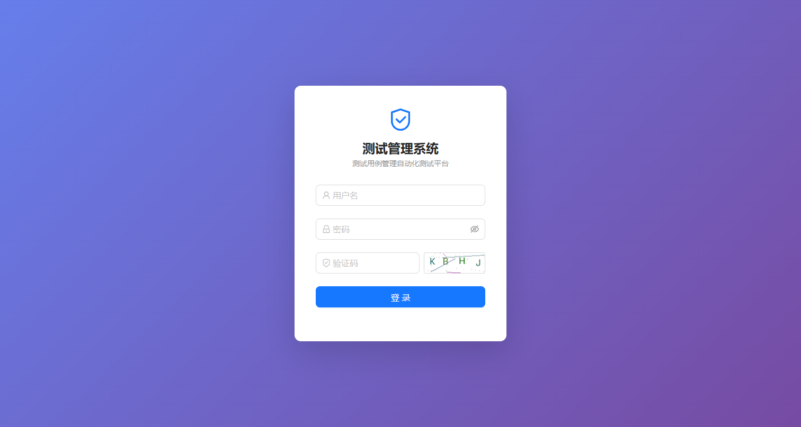

> 💡 系统默认账号为 `admin`（超级管理员），初始密码以部署时的配置为准，请登录后及时在「个人中心 → 修改密码」中修改。
>
> ⚠️ 连续输错密码或验证码会导致登录失败，验证码错误后需点击图片刷新后重新输入。

### 2.2 界面布局

登录后进入主界面，整体分为四个区域：

| 区域 | 说明 |
|------|------|
| 左侧菜单栏 | 系统功能导航，按角色权限动态展示，可点击折叠按钮收起 |
| 顶部面包屑 | 显示「首页 / 当前页面」路径 |
| 右上角用户区 | 头像下拉菜单：个人中心、我的 Agent、Agent 对话、Token 统计、退出登录 |
| 中部内容区 | 各功能页面主体 |

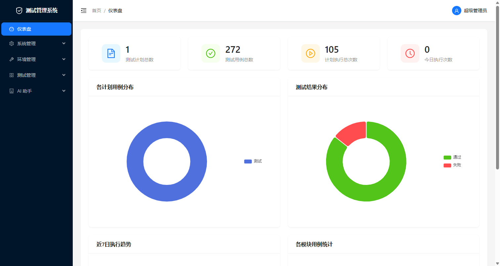

### 2.3 菜单结构

| 一级菜单 | 二级菜单 | 功能 |
|----------|----------|------|
| 仪表盘 | — | 数据统计概览与图表 |
| 系统管理 | 用户管理 / 角色管理 / 权限管理 / 菜单管理 / 部门管理 / 操作日志 / API 密钥 / 企业微信机器人 | 平台基础支撑功能 |
| 环境管理 | Python 环境管理 | conda 虚拟环境纳管 |
| 测试管理 | 项目管理 / 用例管理 / 测试计划 | 测试业务核心 |
| AI 助手 | Agent 对话 / 我的 Agent / LLM 配置 / Token 统计 | AI 能力 |

> 💡 菜单由「系统管理 → 菜单管理」统一配置，并按角色分配。普通用户只能看到被授权的菜单。

---

## 3. 仪表盘

登录后默认进入仪表盘，展示测试业务的整体概况。


**页面内容：**

| 区域 | 内容 |
|------|------|
| 统计卡片 | 测试计划总数、测试用例总数、计划执行总次数、今日执行次数 |
| 各计划用例分布 | 饼图，展示每个测试计划下的用例数量占比 |
| 测试结果分布 | 饼图，展示通过 / 失败等结果占比 |
| 近 7 日执行趋势 | 折线图，展示最近 7 天每日执行次数变化 |
| 各模块用例统计 | 柱状图，展示各业务模块的用例数量 |

**使用步骤：**

1. 登录后自动进入仪表盘；也可点击左侧菜单「仪表盘」进入。
2. 将鼠标悬停在图表上可查看具体数值。
3. 页面数据在每次进入时自动刷新，无需手动操作。

---

## 4. 系统管理

### 4.1 用户管理

管理系统的登录账号，为用户分配部门和角色。

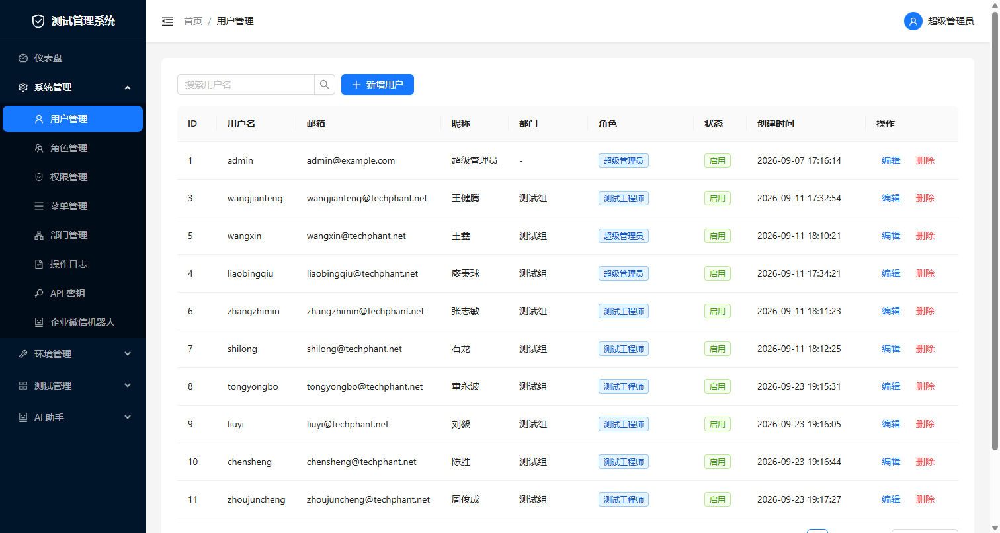

#### 新增用户

1. 进入「系统管理 → 用户管理」，点击右上角「新增用户」按钮。
2. 在弹窗中填写用户信息：

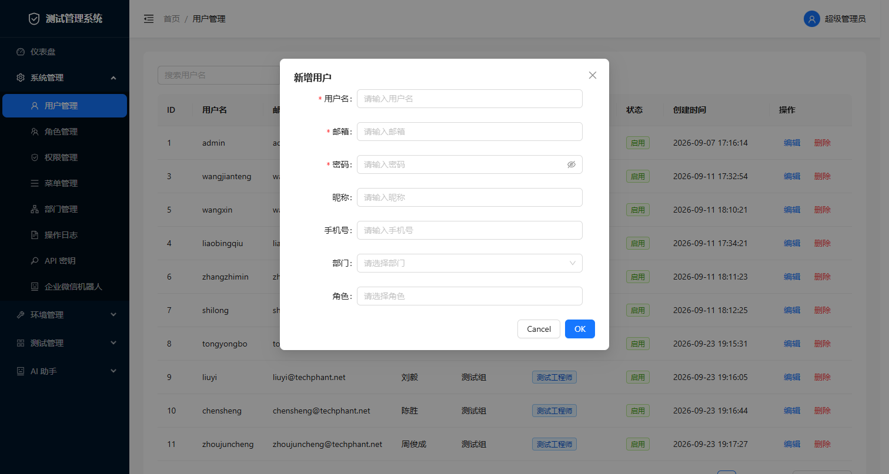

| 字段 | 必填 | 说明 |
|------|------|------|
| 用户名 | ✅ | 登录账号，唯一 |
| 邮箱 | ✅ | 用户邮箱，唯一 |
| 密码 | 新增必填 | 登录密码 |
| 昵称 | — | 显示名称，优先于用户名展示 |
| 手机号 | — | 联系电话 |
| 部门 | — | 从部门树中选择 |
| 角色 | — | 可多选，决定用户的菜单与操作权限 |
| 状态 | — | 启用 / 停用，停用后无法登录 |

3. 点击「确定」完成创建，新用户即可使用该账号登录。

#### 其他操作

| 操作 | 步骤 |
|------|------|
| 搜索 | 顶部输入用户名关键字，点击搜索图标或回车 |
| 编辑 | 点击列表行「编辑」，修改后保存（用户名不可改） |
| 删除 | 点击「删除」并确认；被删除用户立即失效 |
| 分页 | 底部分页器可切换页码与每页条数 |

### 4.2 角色管理

角色是权限的载体，通过为角色分配「API 权限 + 菜单权限」，再将角色赋予用户，实现 RBAC 授权。

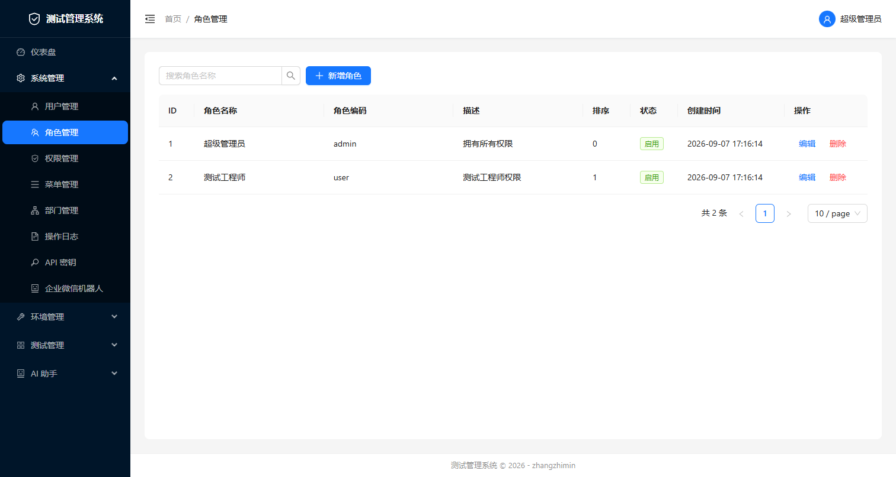

#### 新增角色

1. 进入「系统管理 → 角色管理」，点击「新增角色」。
2. 填写基本信息并分配权限：

| 字段 | 必填 | 说明 |
|------|------|------|
| 角色名称 | ✅ | 如：测试工程师 |
| 角色编码 | ✅ | 唯一编码，如 `tester` |
| 描述 | — | 角色职责说明 |
| 排序 | — | 列表展示顺序 |
| 权限 | — | 勾选该角色可调用的 API 权限（多选） |
| 菜单权限 | — | 树形勾选该角色可见的菜单 |
| 状态 | — | 启用 / 停用 |

3. 点击「确定」保存，然后将角色分配给用户即可生效。

> 💡 授权建议：按岗位职责建立最小权限角色，例如「测试工程师」仅勾选测试管理相关菜单与「用例查看 / 执行」类权限。

#### 其他操作

- **搜索**：按角色名称模糊搜索。
- **编辑 / 删除**：列表行内操作；删除角色前请先解除与用户的关联。

### 4.3 权限管理

维护系统内所有 API 权限点，供角色授权引用。权限编码格式为 `模块:操作`，如 `user:create`、`plan:execute`。

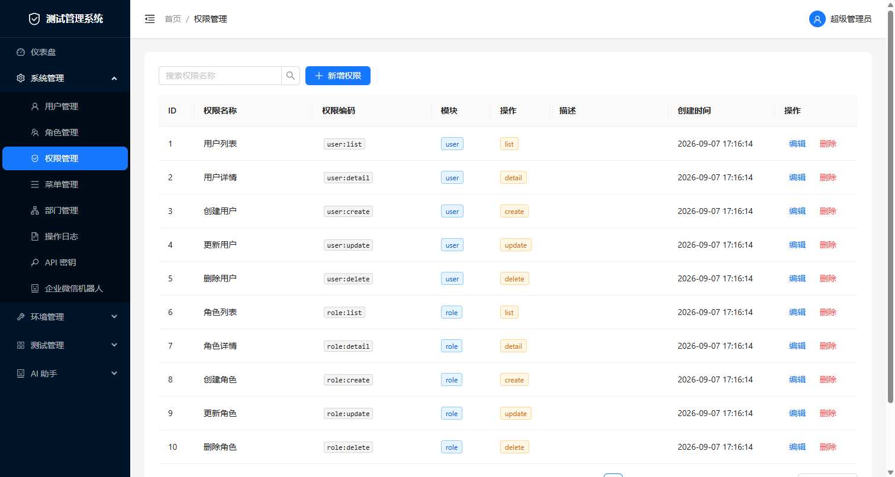

#### 新增权限

1. 进入「系统管理 → 权限管理」，点击「新增权限」。
2. 填写字段：

| 字段 | 必填 | 说明 |
|------|------|------|
| 权限名称 | ✅ | 如：创建用户 |
| 权限编码 | ✅ | 格式 `模块:操作`，唯一 |
| 所属模块 | — | 如：user、plan，便于分组管理 |
| 操作类型 | — | 如：list / create / update / delete |
| 描述 | — | 权限用途说明 |

3. 点击「确定」保存。

> 💡 系统预置了覆盖全部功能的权限点（如 `project:init`、`testcase:import`、`plan:case:execute` 等），一般无需手工新增，仅在二次开发扩展功能时使用。

### 4.4 菜单管理

维护左侧导航菜单树，支持多级菜单，并可绑定权限标识。

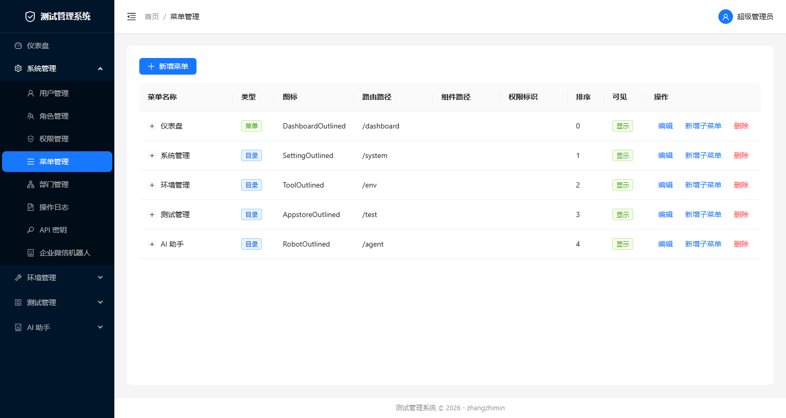

#### 新增菜单

1. 进入「系统管理 → 菜单管理」，点击「新增菜单」（或在某菜单行点击「新增子菜单」创建下级）。
2. 填写字段：

| 字段 | 说明 |
|------|------|
| 上级菜单 | 不选则为顶级菜单 |
| 菜单类型 | 目录 / 菜单 |
| 菜单名称 | 展示在侧边栏的名称 |
| 路由路径 | 前端路由地址，如 `/test/plans` |
| 组件路径 | 页面组件位置（二级菜单通常留空由前端约定） |
| 图标 | 菜单图标 |
| 权限标识 | 关联权限编码，控制菜单可见性 |
| 排序 / 是否显示 | 控制顺序与可见性 |

3. 点击「确定」保存，刷新页面后新菜单生效。

#### 其他操作

- **编辑 / 删除**：列表行内操作；删除父菜单前需先删除其子菜单。
- 菜单树形表格支持按层级展开 / 收起。

### 4.5 部门管理

维护组织架构部门树，用户可归属到指定部门。

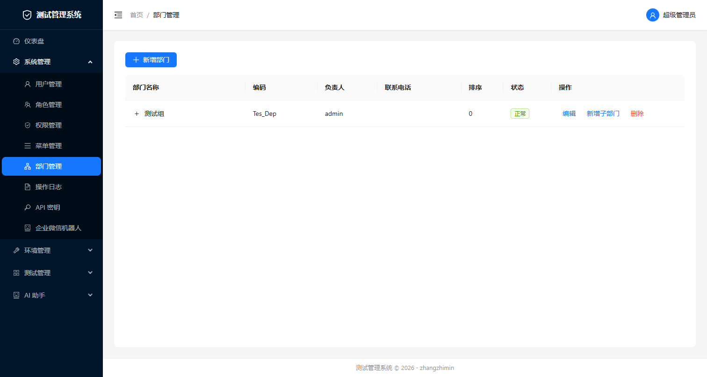

#### 新增部门

1. 进入「系统管理 → 部门管理」，点击「新增部门」（或行内「新增子部门」）。
2. 填写字段：上级部门（不选为顶级）、部门名称（必填）、部门编码、负责人、联系电话、排序、状态。
3. 点击「确定」保存。

#### 其他操作

- 列表以树形展示，支持行内「编辑」「新增子部门」「删除」。
- 删除部门前请先移除或转移该部门下的用户。

### 4.6 操作日志

记录所有 API 请求日志，用于安全审计与问题排查。

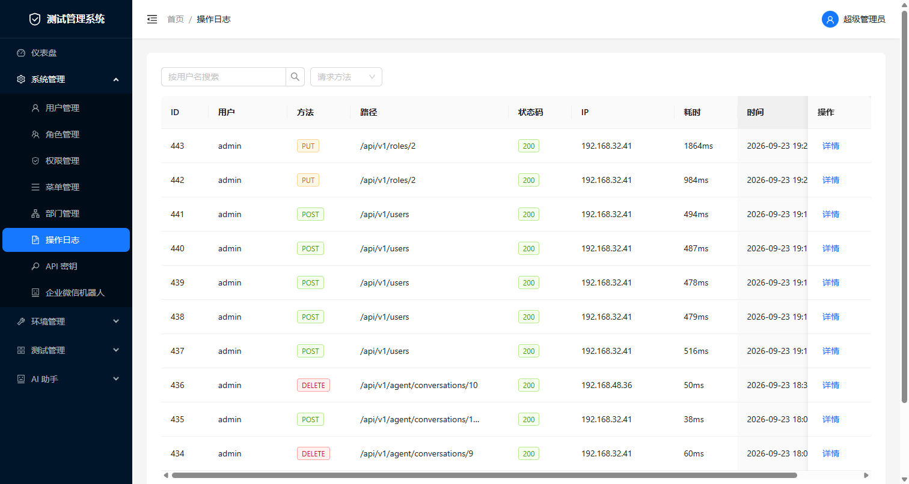

**使用步骤：**

1. 进入「系统管理 → 操作日志」。
2. 按需筛选：输入**用户名**搜索，或选择**请求方法**（GET / POST / PUT / DELETE）过滤。
3. 表格字段说明：

| 列 | 说明 |
|------|------|
| 用户 | 操作人 |
| 方法 | HTTP 方法（GET 绿色 / DELETE 红色等标签） |
| 路径 | 请求的 API 地址 |
| 状态码 | 2xx 绿色、4xx/5xx 红色 |
| IP | 请求来源地址 |
| 耗时 | 请求处理时长 |
| 时间 | 请求发生时间 |

4. 点击行内「详情」可查看请求参数等完整信息。

> 💡 日志为只读记录，不可修改删除。

### 4.7 API 密钥

创建可用于 API 调用的访问密钥，密钥自动关联某个角色的权限，适合开放接口给第三方系统调用。

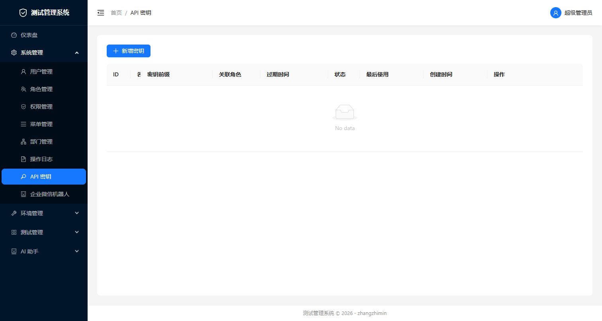

#### 新增密钥

1. 进入「系统管理 → API 密钥」，点击「新增密钥」。
2. 填写字段：

| 字段 | 说明 |
|------|------|
| 密钥名称 | 便于识别用途 |
| 关联角色 | 该密钥以此角色的权限调用 API |
| 过期时间 | 留空表示**永不过期** |

3. 点击「确定」，系统生成完整密钥，**请立即复制保存**（仅在创建时完整展示一次，列表只显示密钥前缀）。

#### 其他操作

- **状态开关**：列表中通过启 / 停开关临时禁用密钥。
- **删除**：不再使用的密钥请及时删除。

### 4.8 企业微信机器人

管理企业微信群机器人 Webhook 配置，供测试计划执行完成后自动推送结果报告。

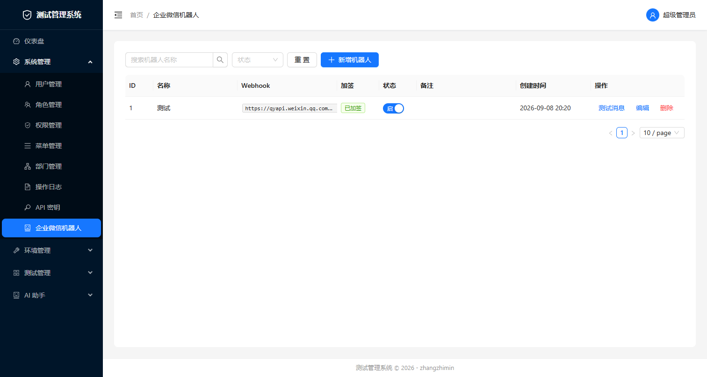

#### 新增机器人

1. 进入「系统管理 → 企业微信机器人」，点击「新增机器人」。
2. 填写字段：

| 字段 | 必填 | 说明 |
|------|------|------|
| 机器人名称 | ✅ | 便于识别，如「测试一组通知」 |
| Webhook | ✅ | 群机器人 Webhook 地址（在企业微信群「添加群机器人」中获取） |
| 加签密钥 | — | 机器人若开启「加签」安全设置则必填 |
| 启用状态 | — | 停用的机器人不会被计划引用 |
| 备注 | — | 补充说明 |

3. 点击「确定」保存。

#### 测试连通性

- 在列表行点击「**测试消息**」，系统向该 Webhook 发送一条测试消息，请到对应企业微信群确认是否收到。

> 💡 推送机制说明：机器人被测试计划引用后，**批量执行 / 定时执行**整轮结束后自动推送一次执行统计（含失败明细）；推送内容以 Markdown 文件形式发送，单文件不超过 20MB。

---

## 5. 环境管理

Python 环境管理用于统一纳管服务器上的 conda 虚拟环境，供测试项目执行自动化用例时选用。

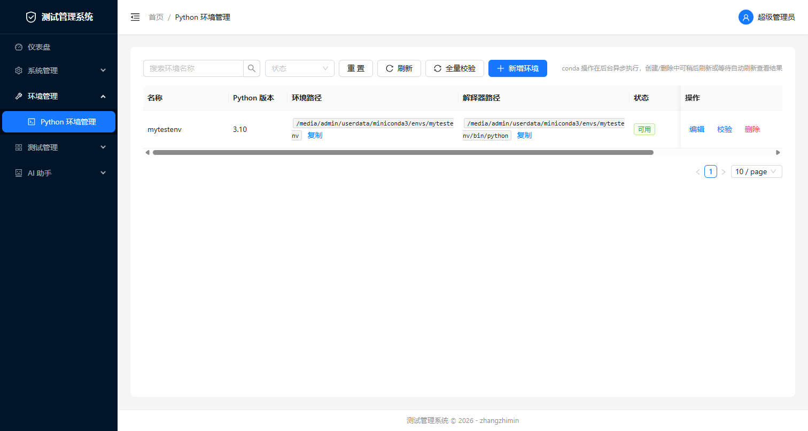

#### 新增环境

1. 进入「环境管理 → Python 环境管理」，点击「新增环境」。
2. 选择 Python 版本并填写环境名称，点击「确定」。
3. 系统在后台异步执行 `conda create`（可能需要数分钟），页面提示任务已提交。
4. 稍后点击「刷新」或等待自动刷新，状态变为「可用」即创建成功。

> 💡 需要服务端开启 conda 配置（`CONDA_ENABLED=true` 并正确配置 Miniconda 路径）后本模块才可用。

#### 其他操作

| 操作 | 说明 |
|------|------|
| 搜索 / 状态筛选 | 按环境名称搜索，按状态过滤 |
| 刷新 | 重新加载列表，查看后台任务最新状态 |
| 校验 | 对单个环境执行连通性与完整性检查，更新状态 |
| 全量校验 | 一次性校验列表中所有环境 |
| 复制路径 | 环境路径 / Python 路径列提供一键复制 |
| 编辑 | 修改环境名称、备注等信息（进行中不可编辑） |
| 删除 | **将同时删除实际环境目录与数据库记录**，请先确认没有项目正在使用该环境 |

> ⚠️ 状态标签悬停可查看失败原因（error_msg）与上次校验时间，创建失败时可根据错误信息排查。

---

## 6. 测试管理

### 6.1 项目管理

项目是测试业务的顶层组织单元，一个被测系统对应一个项目。项目同时承载自动化代码（pytest 工程）。

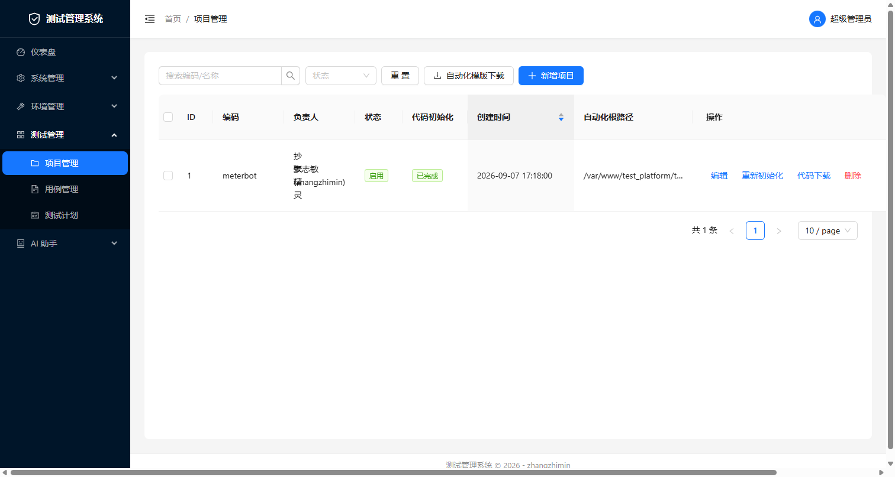

#### 新增项目并初始化自动化代码

1. 进入「测试管理 → 项目管理」，点击「新增项目」。

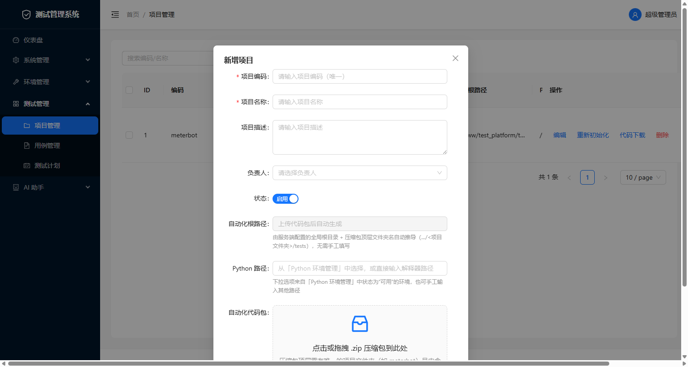

2. 填写字段：

| 字段 | 必填 | 说明 |
|------|------|------|
| 项目编码 | ✅ | 项目唯一编码，如 `meterbot` |
| 项目名称 | ✅ | 项目显示名称 |
| 项目描述 | — | 项目背景说明 |
| 负责人 | — | 从用户列表选择 |
| 状态 | — | 启用 / 停用 |
| 自动化根路径 | — | 只读，上传代码包后由服务端自动推导生成 |
| Python 路径 | — | 下拉选择「Python 环境管理」中状态为可用的环境，也可手工输入解释器路径 |
| 自动化代码包 | — | 拖拽上传 `.zip` 压缩包 |

3. **自动化代码包要求**：
   - 压缩包顶层必须**有且仅有一个项目文件夹**（如 `meterbot`），且该文件夹内**必须包含 `tests` 目录**；
   - 上传后服务端将代码解压到全局根目录，并使用所选 Python 环境自动执行 `pip install -r requirements.txt` 安装依赖。
4. 点击「确定」提交。若同时上传了代码包，系统继续提交代码初始化任务。
5. 列表中「代码初始化」列实时显示任务状态：**未初始化 → 排队中 → 解压中 → 装依赖中 → 已完成 / 失败**（页面每 5 秒自动轮询刷新）。将鼠标悬停在状态标签上可查看完整初始化日志或失败原因。

> 💡 不确定代码包结构？点击顶部「**自动化模版下载**」获取标准模板，按模板组织代码后上传。

#### 其他操作

| 操作 | 说明 |
|------|------|
| 搜索 / 筛选 | 按编码 / 名称关键字搜索，按状态筛选，点击「重置」清空条件 |
| 初始化代码 / 重新初始化 | 行内按钮，弹窗中重新上传 zip（同名文件覆盖、多出的旧文件保留） |
| 重装依赖 | 初始化失败时可单独重新执行 `pip install` |
| 代码下载 | 将服务端该项目的自动化代码整体打包为 zip 下载 |
| 编辑 / 删除 | 行内操作，删除需二次确认 |
| 排序 | 「创建时间」列可切换升序 / 降序，默认最新在前 |

### 6.2 用例管理

以「模块树 + 用例列表」两级结构管理测试用例，支持手工用例与自动化用例统一维护。

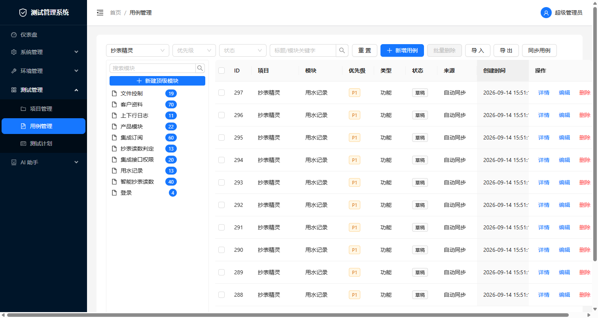

#### 界面说明

- **左侧模块树**：按项目展示模块层级，节点上有用例数量徽标；顶部可搜索模块、「新建顶级模块」；节点悬停可操作「新增用例 / 新增子模块 / 编辑 / 删除」。
- **右侧用例列表**：受当前选中模块过滤；支持按项目、优先级、状态、关键字（标题 / 模块）筛选。

#### 新增用例

1. 进入「测试管理 → 用例管理」，先在顶部选择**所属项目**（或在左侧模块树某节点上点「新增用例」自动带上模块）。
2. 点击「新增用例」，右侧弹出抽屉表单：

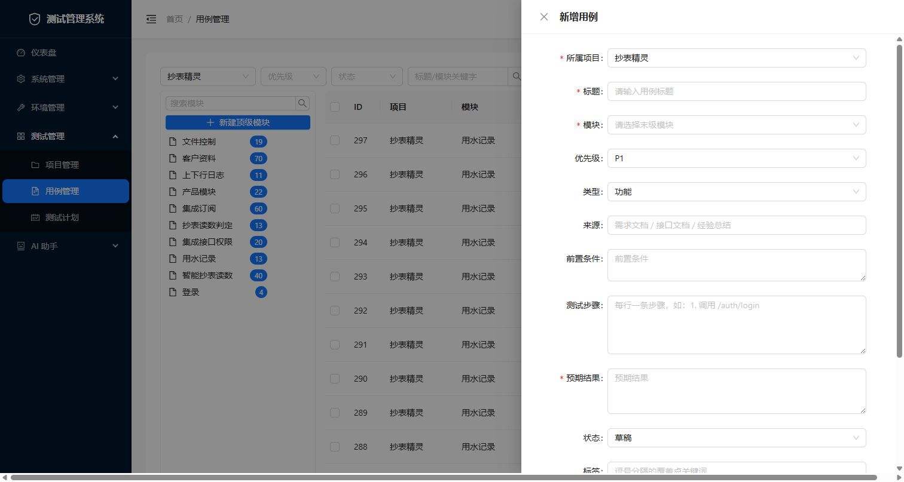

3. 填写字段：

| 字段 | 必填 | 说明 |
|------|------|------|
| 所属项目 | ✅ | 下拉选择（支持搜索） |
| 标题 | ✅ | 用例名称 |
| 模块 | ✅ | 树形下拉，**必须选择末级模块** |
| 优先级 | — | P0 ~ P3 |
| 类型 | — | 功能 / 性能 / 接口等 |
| 来源 | — | 需求文档 / 接口文档 / 经验总结 |
| 前置条件 | — | 执行该用例的前提 |
| 测试步骤 | — | 每行一条步骤，如 `1. 调用 /auth/login` |
| 预期结果 | ✅ | 用例通过判定标准 |
| 状态 | — | 草稿 / 已评审等流转状态 |
| 标签 | — | 逗号分隔的覆盖点关键词 |
| 模块编码 | — | 自动带出，只读（对应 pytest 文件路径） |
| 用例编码 | — | 自动化用例的 pytest 函数名，需以 `test_` 开头，如 `test_list_columns` |

4. 点击「保存」完成。

> 💡 **自动化用例绑定**：填写「用例编码」后，该用例即与项目自动化代码中 `tests/<模块编码>.py` 里的 `test_<用例编码>` 函数关联，可在测试计划中一键执行。模块编码由模块树的「目录名 / 文件名」自动生成。

#### 导入 / 导出 / 同步

| 操作 | 步骤 |
|------|------|
| 批量导入 | 点击「导入」→ 在弹窗中先「下载导入模板」→ 按模板填写后选择 CSV / Excel 文件 → 「确认导入」 |
| 导出 | 点击「导出」，按当前筛选条件导出 CSV 文件 |
| 同步用例 | 选择项目后点击「同步用例」，系统扫描项目自动化根路径下的 pytest 用例文件，将未入库的用例批量同步到平台（自动建立模块、优先级等默认信息） |
| 批量删除 | 勾选多条用例后点击「批量删除」 |
| 详情 | 行内「详情」查看用例全部字段（只读弹窗） |

#### 模块管理

1. 在左侧模块树点击「新建顶级模块」或在某节点上「新增子模块」。
2. 填写：所属项目、上级模块、模块名称、**目录名 / 文件名**、描述、排序。
   - 目录名 / 文件名决定自动化用例文件的存放路径，文件名需以 `test_` 开头（表单内有路径预览）。
3. 模块编辑 / 删除在节点操作中进行；删除模块不影响其下用例数据，但建议先迁移用例。

### 6.3 测试计划

测试计划从项目中挑选一批用例组成执行集合，支持手工记录结果与自动化执行，并可定时自动执行、推送报告。

#### 计划列表与创建

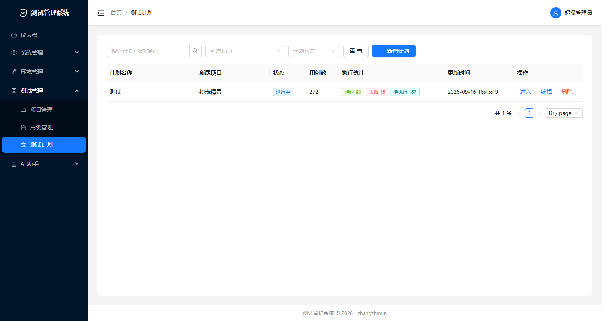

1. 进入「测试管理 → 测试计划」，点击「新增计划」。
2. 填写字段：

| 字段 | 必填 | 说明 |
|------|------|------|
| 计划名称 | ✅ | 如「抄表精灵每日回归」 |
| 所属项目 | ✅ | 创建后不可更改 |
| 计划状态 | — | 未开始 / 进行中 / 已完成 |
| 计划描述 | — | 测试范围、依据等 |
| 推送机器人 | — | 多选企业微信机器人；**批量执行 / 定时执行**整轮结束后推送一次统计（含失败明细） |
| AI 结果汇总 | — | 选择当前用户的 Agent；整轮执行完成后先由 AI 汇总测试结果再推送（AI 异常时自动回退为统计推送；保存时自动为该 Agent 创建会话） |

3. 点击「确定」保存，列表中点击「**进入**」打开计划详情。

#### 计划详情：添加用例与执行

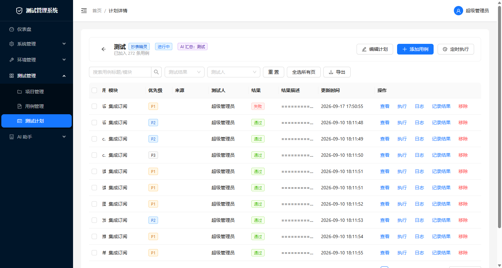

**添加用例：**

1. 在计划详情页点击「添加用例」。

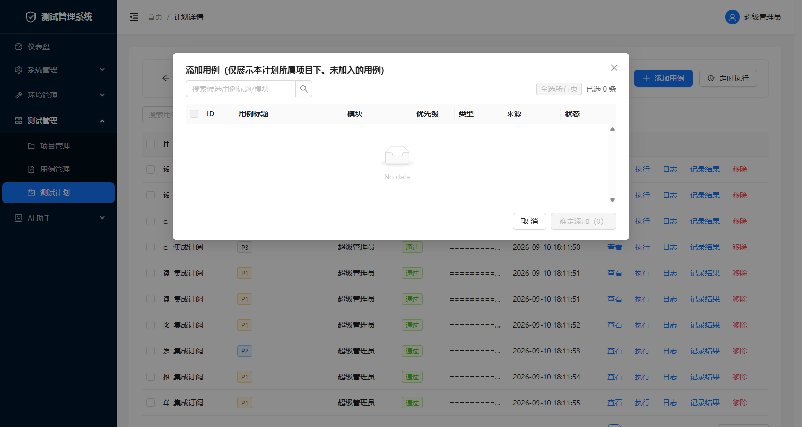

2. 弹窗中仅展示**本项目下尚未加入计划的用例**，支持关键字搜索与跨页「全选所有页」。
3. 勾选后点击「确定添加（N）」完成。

**筛选与批量操作：**

| 按钮 | 说明 |
|------|------|
| 搜索 / 筛选 | 按用例标题 / 模块关键字、测试结果、测试人过滤 |
| 全选所有页 | 跨页全选当前筛选结果 |
| 批量执行 (N) | 对勾选的自动化用例**串行**执行（需用例已绑定模块编码 + 用例编码） |
| 停止执行 | 存在运行中用例时显示，点击后停止批量任务，剩余用例标记为「跳过」 |
| 导出 | 导出计划内用例及执行结果 |

**单条用例操作：**

| 操作 | 说明 |
|------|------|
| 查看 | 查看用例详情（前置条件、测试步骤、预期结果） |
| 执行 | 立即执行该自动化用例（仅已绑定编码的用例显示；执行中置灰） |
| 日志 | 打开抽屉查看该用例的**历史执行日志**（每次执行的通过 / 失败摘要与完整 pytest 输出，可刷新） |
| 记录结果 | 人工登记执行结果：选择「通过 / 失败 / 阻塞 / 跳过 / 待执行」并填写结果描述（失败原因、测试过程） |
| 移除 | 将用例移出本计划（用例本身不受影响） |

#### 定时执行

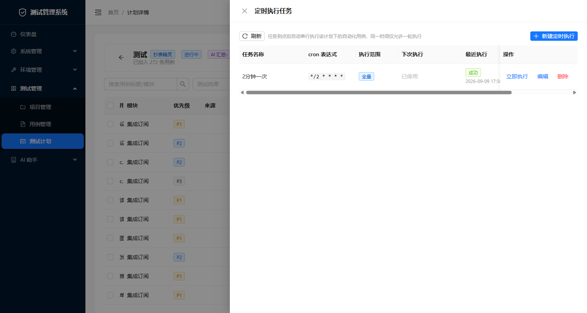

1. 在计划详情页点击「**定时执行**」，右侧弹出定时任务抽屉。
2. 点击「新建定时任务」，设置**执行周期（Cron 表达式）**与启用状态。
3. 到达设定时间后，系统自动对该计划内全部自动化用例发起一轮串行执行，完成后按计划配置推送报告。
4. 抽屉内可对任务进行「编辑 / 启用停用 / 删除」，也可点击「立即执行」手动触发一轮。

> 💡 定时任务由服务端调度器统一驱动（每 30 秒轮询一次），同一任务不会被重复触发；任务运行超过 4 小时未结束会被自动复位为异常状态。

#### 报告推送与 AI 汇总

- 批量执行 / 定时执行整轮结束后：
  1. 若计划配置了 **AI 结果汇总**（Agent），系统先调用 Agent 对全部用例结果做智能分析；
  2. 随后将执行统计（含失败明细）整理为 Markdown 报告，通过所选**企业微信机器人**以文件消息推送至群聊；
  3. AI 调用异常时自动回退为纯统计推送，不影响通知送达。

---

## 7. AI 助手

### 7.1 LLM 配置

先配置大模型服务的接入信息，Agent 才能绑定使用。

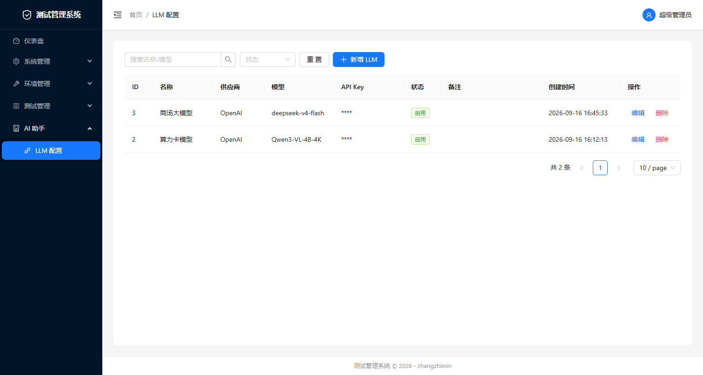

#### 新增 LLM

1. 进入「AI 助手 → LLM 配置」，点击「新增 LLM」。
2. 填写字段：

| 字段 | 说明 |
|------|------|
| 名称 | 配置显示名称 |
| 供应商 | 如 OpenAI 兼容接口 / DeepSeek / 通义千问等 |
| 模型 | 模型名，如 `qwen-max`、`deepseek-chat` |
| Base URL | 模型服务接口地址 |
| API Key | 供应商颁发的密钥（加密存储，列表仅显示掩码） |
| Temperature | 采样温度，值越大回答越发散 |
| Max Tokens | 单次回复最大 token 数 |
| 超时 | 请求超时时间（秒） |
| 状态 | 启用 / 停用 |

3. 点击「确定」保存。

#### 其他操作

- 按名称 / 模型搜索，按状态筛选；行内编辑、删除。

### 7.2 我的 Agent

Agent = LLM 模型 + 系统提示词 + 工具集合，是可复用的 AI 助手。测试计划的「AI 结果汇总」也需要先创建 Agent。

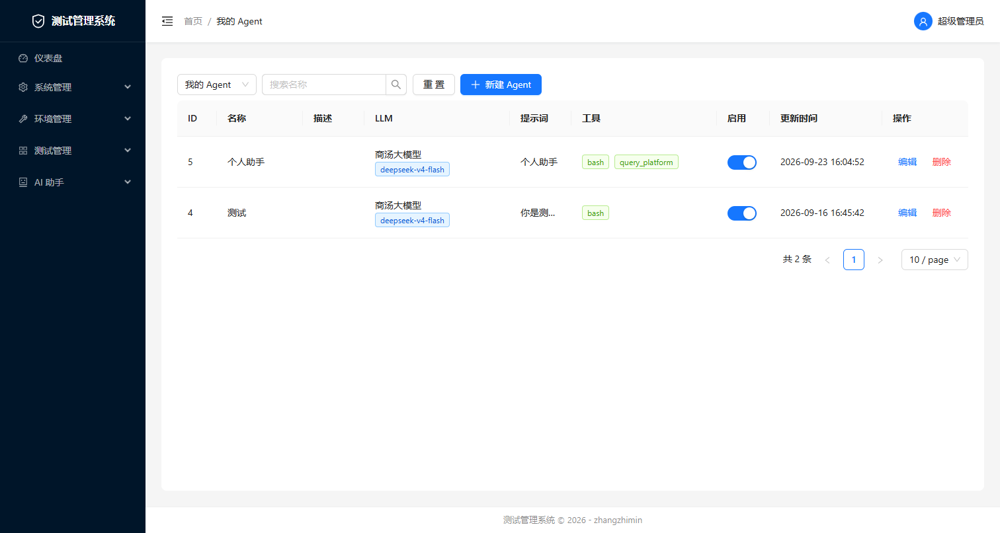

#### 新建 Agent

1. 进入「AI 助手 → 我的 Agent」，点击「新建 Agent」。
2. 填写字段：

| 字段 | 说明 |
|------|------|
| 名称 | Agent 显示名称 |
| 描述 | 用途说明 |
| LLM 模型 | 选择「LLM 配置」中启用的模型 |
| 系统提示词 | 定义 Agent 的角色、行为规范，如「你是测试结果分析专家…」 |
| 可用工具 | 勾选 Agent 可调用的工具（复选框多选） |
| 状态 | 启用 / 停用 |

3. 点击「确定」保存。

#### 其他操作

- 超级管理员可在顶部切换查看「我的 Agent / 全部 Agent」。
- **删除 Agent 前需先删除其所有会话**（系统会给出确认提示）。

### 7.3 Agent 对话

与 Agent 进行多轮会话，支持查看 AI 的思考过程与工具调用详情。

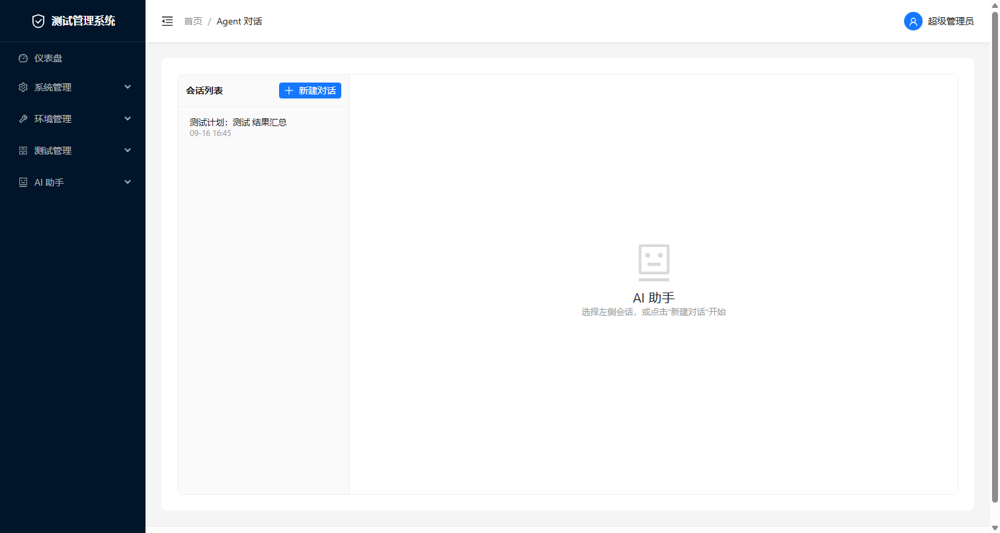

**使用步骤：**

1. 进入「AI 助手 → Agent 对话」（也可从右上角用户菜单进入）。
2. 点击左侧「**新建对话**」，在弹窗中选择一个 Agent（卡片上会展示其名称、绑定模型、描述、工具标签）。
3. 在底部输入框输入问题，点击「发送」。
4. 对话区会依次展示：用户消息、AI 的**思考过程**、**工具调用**记录、最终回复；生成中会有动态提示。
5. 单条回复异常时可点击「重试」重新生成。
6. 左侧会话列表可切换历史会话继续对话。

> 💡 底部提示「AI 生成内容仅供参考」，关键结论请人工复核。

### 7.4 Token 统计

查看当前登录用户的 LLM 用量。

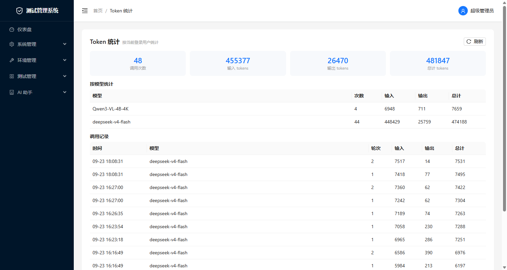

**页面内容：**

| 区域 | 说明 |
|------|------|
| 统计卡片 | 调用次数、输入 tokens、输出 tokens、总计 tokens |
| 按模型统计 | 各模型的调用次数与 token 消耗分布 |
| 调用记录 | 明细流水（时间、模型、消耗等） |

页面按**当前登录用户**统计，点击右上角「刷新」获取最新数据。

---

## 8. 个人中心

维护个人信息与登录密码。

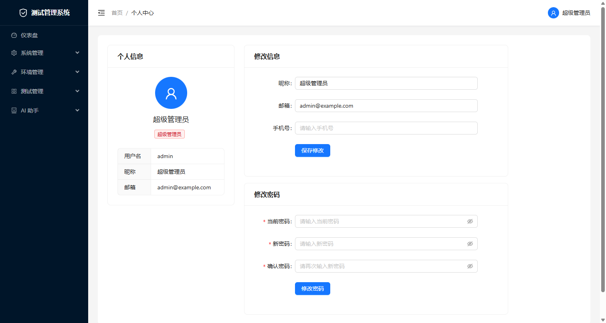

**使用步骤：**

1. 点击右上角头像 → 「个人中心」。
2. 左侧展示个人信息卡片：用户名、昵称、邮箱、角色标签。
3. 右侧表单：
   - **修改信息**：更新昵称、手机号等，点击保存；
   - **修改密码**：输入原密码与新密码（建议 8 位以上，含字母数字符号），点击保存后使用新密码重新登录。

---

## 9. 典型业务流程

### 9.1 自动化测试全流程（推荐路径）

```
准备 Python 环境 → 创建项目并上传代码包 → 搭建模块树 → 编写/导入/同步用例
→ 创建测试计划并添加用例 → 执行（单条 / 批量 / 定时）→ 查看结果与日志
→ （可选）AI 汇总 → 企业微信推送报告
```

1. **准备环境**：「环境管理」确认有一个状态为「可用」的 Python 环境。
2. **创建项目**：「项目管理 → 新增项目」，填写编码 / 名称，选择 Python 路径，上传符合结构要求的 zip 代码包，等待「代码初始化」变为已完成。
3. **搭建模块**：「用例管理」左侧模块树按业务域创建模块（目录名 / 文件名将决定 pytest 文件路径）。
4. **维护用例**：手工「新增用例」并填写用例编码（`test_` 开头）；或使用「导入」批量导入；已有一份 pytest 工程时，直接「同步用例」自动入库。
5. **创建计划**：「测试计划 → 新增计划」，绑定项目，按需配置推送机器人与 AI 汇总 Agent。
6. **添加用例**：进入计划详情，「添加用例」挑选用例。
7. **执行**：勾选后「批量执行」，或配置「定时执行」周期回归；执行过程可随时「停止执行」。
8. **查看结果**：列表查看结果标签，行内「日志」查看 pytest 完整输出；失败用例人工「记录结果」补充说明。
9. **接收报告**：整轮执行结束后，企业微信群自动收到 Markdown 报告文件（含统计表格、通过率与失败明细）。

### 9.2 手工测试流程

创建项目 → 维护用例 → 加入计划 → 人工执行后「记录结果」（通过 / 失败 / 阻塞）→ 导出计划数据归档。

### 9.3 权限配置流程

创建部门 → 创建用户 → 创建角色（勾选权限 + 菜单）→ 将角色分配给用户 → 用户重新登录后生效。

---

## 10. 常见问题 FAQ

**Q1：登录时提示「验证码错误」或「验证码已过期」？**
验证码一次性有效且数分钟后过期。点击验证码图片刷新后重新输入；大小写不敏感，注意区分易混淆字符（如 0/O、1/I）。

**Q2：登录后左侧菜单不全或看不到某个功能？**
菜单按角色分配。请联系管理员在「角色管理」中为您的角色勾选对应菜单权限，并确认用户已分配该角色。

**Q3：点击按钮提示无权限？**
按钮级权限由角色控制（如 `project:create`、`plan:case:execute`）。请联系管理员在角色中补充对应的 API 权限点。

**Q4：项目代码初始化失败怎么办？**
将鼠标悬停在「代码初始化」状态标签上查看失败原因与日志。常见原因：zip 顶层不是一个包含 `tests` 目录的唯一文件夹、`requirements.txt` 安装超时。修正后点「重新初始化」；仅依赖问题时可点「重装依赖」。

**Q5：测试计划中某条用例没有「执行」按钮？**
该用例未绑定自动化编码（模块编码 / 用例编码为空），属于手工用例。请在「用例管理」编辑该用例填写以 `test_` 开头的用例编码，且确保对应函数存在于项目自动化代码中。

**Q6：执行用例提示超时？**
单用例默认执行超时 120 秒（服务端 `EXEC_TIMEOUT_SECONDS` 可调）。OTA 升级、组网等长耗时用例请联系运维调大该配置。

**Q7：批量执行想中途终止？**
执行过程中计划详情页会出现红色「停止执行」按钮，点击后任务终止，剩余未执行用例自动标记为「跳过」。

**Q8：企业微信群收不到推送？**
依次检查：① 计划是否配置了「推送机器人」；② 机器人是否启用、Webhook / 加签密钥是否正确；③ 在「企业微信机器人」列表对该机器人点「测试消息」验证连通性；④ 推送仅在**批量 / 定时**整轮结束后触发，单条手工执行不推送。

**Q9：AI 汇总没有生效？**
确认：① 已在「LLM 配置」配置并启用模型；② 已创建 Agent 并在计划中选择了「AI 结果汇总」；③ Agent 调用异常时系统会自动回退为统计推送，不影响报告送达。

**Q10：Token 用量是按什么口径统计的？**
「Token 统计」仅统计当前登录用户自己的 LLM 调用（对话、AI 汇总等），可按模型查看分布与明细。

**Q11：忘记密码怎么办？**
联系管理员在「用户管理」中为您重置密码；管理员本人可通过数据库脚本或联系其他超级管理员处理。

---

*本手册基于系统当前版本编写，界面可能随版本迭代略有调整。如有疑问请联系系统管理员。*
